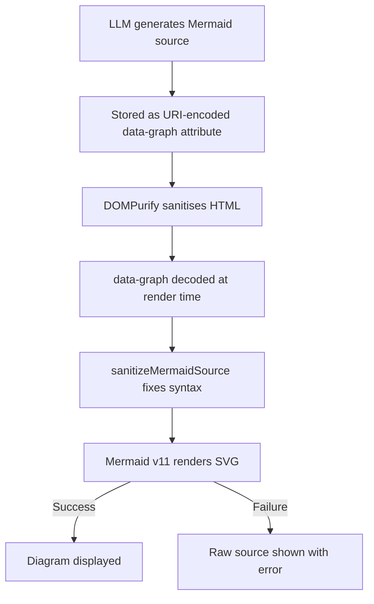
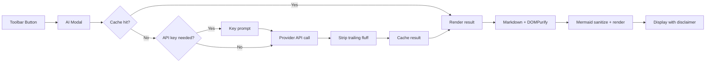

# AI Script Analysis

QvsView.qs includes an optional AI-powered script analysis feature that sends your Qlik load script to an LLM for review and returns results as formatted Markdown with Mermaid diagrams.

## Supported Providers

| Provider  | Endpoint default               | Auth             | Best for           |
| --------- | ------------------------------ | ---------------- | ------------------ |
| Ollama    | `http://127.0.0.1:11434`       | None required    | Air-gapped / local |
| OpenAI    | `https://api.openai.com/v1`    | API key (Bearer) | Cloud              |
| Anthropic | `https://api.anthropic.com/v1` | API key (header) | Cloud              |

## Setup

1. **Enable AI Analysis** in the property panel under _AI Analysis → Enable AI Analysis_.
2. **Choose a provider** and configure:
    - **Ollama**: Set the endpoint (defaults to `127.0.0.1:11434`), select a model from **Available models** or type any model name into **Model**, and optionally click **🔄 Refresh model list** to re-fetch available models from the endpoint.
    - **OpenAI / Anthropic**: Set the endpoint, choose from **Available models** or type a custom model name into **Model**, and configure the API key mode:
        - **Stored**: Key saved in the Qlik object properties (convenient but visible to anyone with access to the object).
        - **Prompt at runtime**: Key is requested when you click Analyze and cached in `sessionStorage` for the browser session.
3. **Optionally configure**:
    - **Analysis scope**: Current section or full script.
    - **Prompt template**: General, Security, Performance, or Documentation.
    - **Loading quote cycle**: How many seconds each humorous loading message is shown (3–10 seconds, default 5).
    - **Custom system prompt**: Additional instructions appended to the chosen template.
4. Click the **🤖 Analyze** button in the toolbar.

### Ollama CORS Configuration

When Qlik Sense is served over **HTTPS** and Ollama runs on **HTTP** (the default), browsers block the request due to CORS / mixed-content restrictions. Two options:

**Option A — OLLAMA_ORIGINS** (allows mixed HTTP/HTTPS):

```bash
# Allow requests from your Qlik Sense server
OLLAMA_ORIGINS="https://your-qlik-server.example.com" ollama serve

# Or allow all origins (less secure, useful for testing)
OLLAMA_ORIGINS="*" ollama serve
```

On **macOS** (Ollama desktop app), set the variable before launching:

```bash
launchctl setenv OLLAMA_ORIGINS "https://your-qlik-server.example.com"
```

On **Linux** (systemd service), edit the service override:

```bash
sudo systemctl edit ollama
# Add under [Service]:
# Environment="OLLAMA_ORIGINS=https://your-qlik-server.example.com"
sudo systemctl restart ollama
```

On **Windows**, set `OLLAMA_ORIGINS` as a system environment variable then restart the Ollama service.

**Option B — HTTPS Reverse Proxy** (recommended for production):

Use a reverse proxy like [Caddy](https://caddyserver.com/) to expose Ollama over HTTPS, eliminating mixed-content issues entirely:

```bash
caddy reverse-proxy --from https://localhost:11435 --to http://127.0.0.1:11434
```

Then set the Ollama endpoint in the property panel to `https://localhost:11435`.

## Prompt Templates

Four built-in templates optimise the system prompt for different analysis goals:

| Template      | Focus                                                    |
| ------------- | -------------------------------------------------------- |
| General       | Summary, data flow, Mermaid flowchart, improvements      |
| Security      | Credentials, injection risks, file access, data exposure |
| Performance   | WHERE clauses, joins, resident loads, memory usage       |
| Documentation | Comprehensive docs with data model diagrams              |

Each template includes strict Mermaid formatting rules to maximize diagram rendering success. You can also provide a **Custom system prompt** that is appended to the chosen template.

## Analysis Scope

- **Current section** — Analyses only the visible tab.
- **Full script** — Analyses the entire concatenated script.

## Loading Experience

While waiting for the AI response, the modal displays:

- **Cycling humorous quotes** — 24 themed messages (rocket launch, Yoda, pirate, mission control, chef, Star Wars, etc.) with smooth fade transitions. Cycle time is configurable in the property panel (3–10 seconds).
- **Elapsed timer** — Tracks how long the analysis has been running.
- **Snake mini-game** — An optional retro-themed Snake game (canvas-based, WASD/arrow keys) to pass the time.

## Caching

Results are cached in `sessionStorage` for 30 minutes, keyed by script content + AI configuration. Click **🔄 Re-analyze** in the modal to bypass the cache.

## Output

Results are rendered as Markdown with:

- Headings, lists, code blocks, tables, blockquotes
- **Mermaid diagrams** (flowcharts, ER diagrams, sequence diagrams) — loaded from CDN at runtime
- **AI disclaimer** — A warning banner reminding users that AI-generated analysis may contain inaccuracies
- **Metadata footer** — Model name, provider, and elapsed analysis time
- **Copy** to clipboard / **Download** as `.md` file (includes YAML front matter with model, provider, analysis time, and date)

### Post-Processing

Before rendering, the LLM response goes through two post-processing steps:

1. **Trailing fluff removal** — Conversational filler that LLMs often append ("Let me know if…", "Feel free to…", "Happy to help…") is automatically stripped from the end of the response.
2. **Mermaid source sanitization** — Parentheses inside quoted node labels (e.g. `Chr()`, `Rand()`) are replaced with visually identical Unicode equivalents so Mermaid's parser doesn't misinterpret them as node shape syntax. HTML tags like `<br/>` are also stripped.

## Mermaid Diagram Rendering

Mermaid diagrams go through a multi-stage pipeline to maximize rendering success:



Key design decisions:

- **URI-encoded `data-graph` attribute**: Raw Mermaid source is stored as `encodeURIComponent()` in a `data-graph` attribute on the `<pre>` element. This completely bypasses DOMPurify's HTML sanitization, which would otherwise corrupt Mermaid syntax (e.g. converting `"` to `&quot;`, stripping angle brackets).
- **`securityLevel: 'antiscript'`**: Allows HTML entity rendering in labels while still blocking script execution. The previous `'strict'` mode rejected too many valid diagram patterns.
- **Automatic parenthesis escaping**: `()` inside `["..."]` and `("...")` labels are converted to full-width Unicode `（）`, preventing Mermaid from interpreting them as shape syntax.
- **`<br/>` stripping**: HTML line breaks in labels (commonly generated by LLMs) are replaced with spaces before parsing.

## Bundle Size

The AI analysis feature adds ~30 KB to the extension (DOMPurify + AI modules). Mermaid (~200 KB) is loaded from CDN (`cdn.jsdelivr.net`) only when diagrams are present in the AI response. Internet access is required for diagram rendering.

## Security Notes

- All rendered Markdown is sanitised with [DOMPurify](https://github.com/cure53/DOMPurify) — only `<pre>` tags and `class`/`data-graph` attributes are whitelisted beyond defaults.
- Mermaid runs with `securityLevel: 'antiscript'` — blocks script execution while allowing HTML entities in labels.
- API keys in "prompt" mode are stored in `sessionStorage` (cleared when the browser tab closes).
- API keys in "stored" mode are saved in the Qlik object properties — accessible to anyone who can view the object JSON.
- Scripts are sent to the configured AI provider endpoint. Ensure your organisation's data policies allow this.

## Architecture



### File Structure

```
src/ai/
├── cache.js              # sessionStorage cache (30-min TTL)
├── key-manager.js        # API key resolution (stored / prompt)
├── markdown-renderer.js  # Markdown → HTML + DOMPurify (data-graph for Mermaid)
├── mermaid-init.js       # Mermaid CDN loading, source sanitization, SVG rendering
├── providers.js          # Ollama / OpenAI / Anthropic callers
└── system-prompt.js      # 4 prompt templates with strict Mermaid formatting rules
src/ui/
└── ai-modal.js           # Modal dialog, loading UX, Snake game, fluff stripper
src/ext/
└── ai-section.js         # Property panel: provider config, model dropdown, quote cycle
```

src/ui/
└── ai-modal.js # Modal dialog (loading / result / error / key prompt)

src/ext/
└── ai-section.js # Property panel section

```

```
