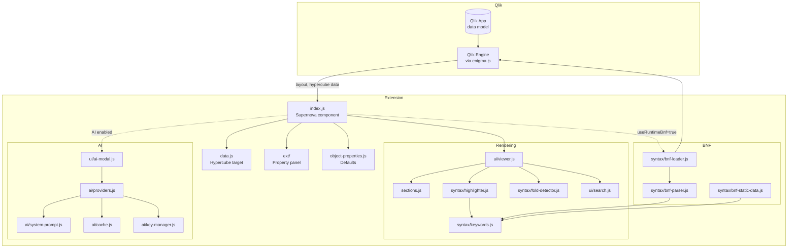
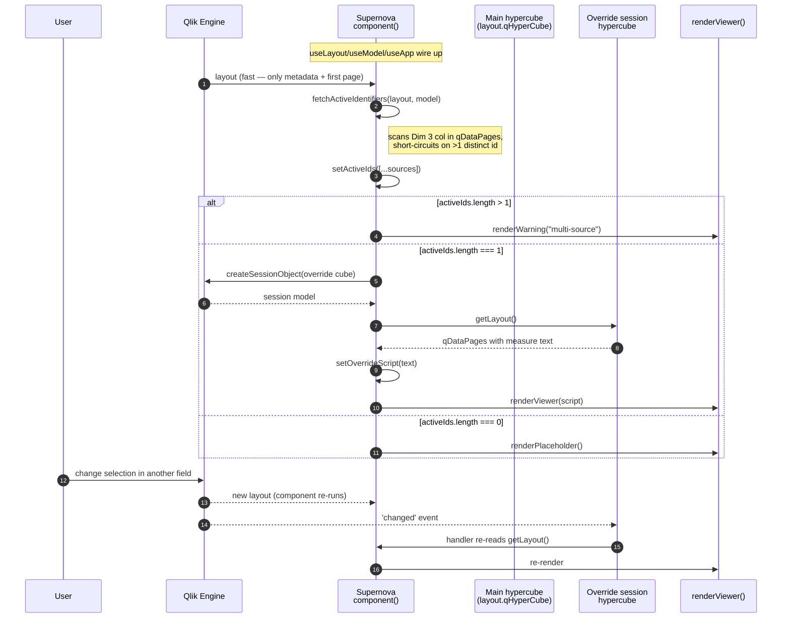
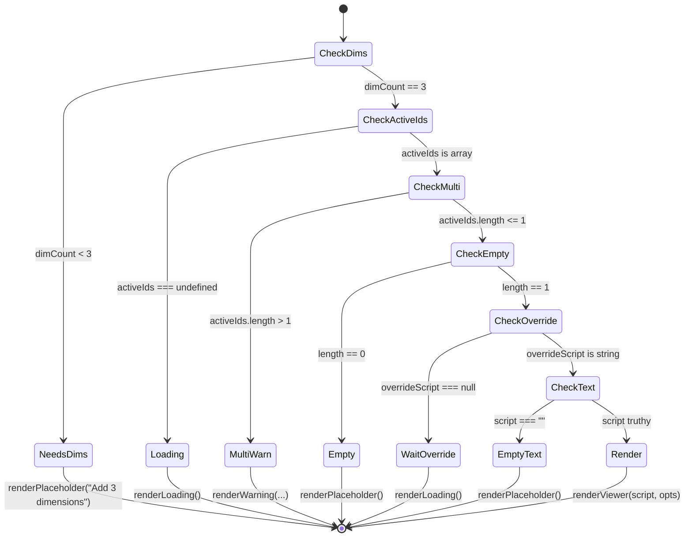
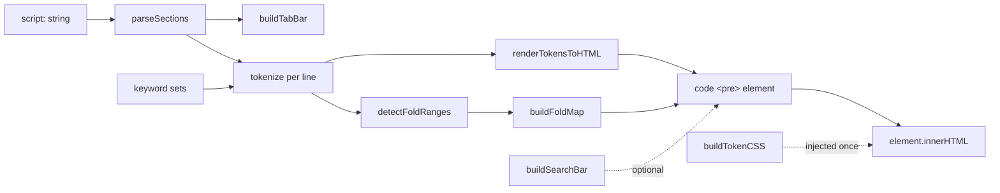
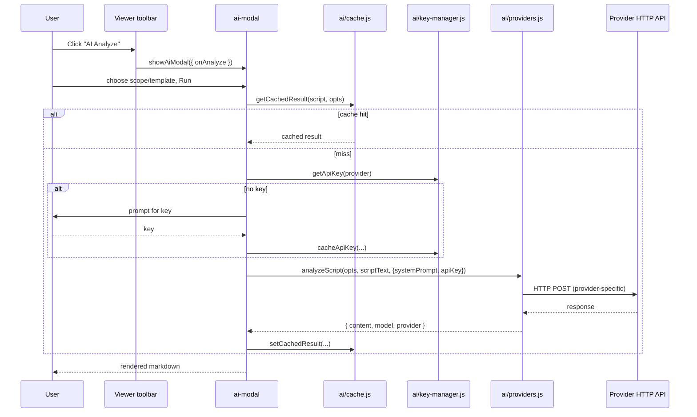
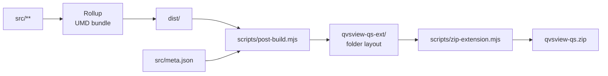

# QvsView.qs — Architecture for Extension Developers

This document explains how the QvsView.qs extension is built. It is written for
developers familiar with both Qlik Sense and modern JavaScript who want to
extend, debug or fork the codebase. Concepts that are specific to nebula.js or
to Qlik's associative engine are explained inline.

> If you only want to **use** the extension, see
> [getting-started.md](./getting-started.md) and
> [configuration.md](./configuration.md).

---

## 1. What the extension does

QvsView.qs is a **read-only Qlik script viewer** with syntax highlighting,
folding, search, section tabs and an optional AI analysis pane.

The script text is _not_ loaded from a file. It comes from the data model: the
extension is bound to a hypercube where one dimension is "the script text" —
typically a field in a data table whose rows each hold one line of script.

Typical use case:

- A Qlik app loads metadata from many other apps (file name, app id, script
  text, row number) and presents them via filter panes and a QvsView object.
- The user picks a single app in a filter pane → QvsView shows the full script
  of that app, with full Qlik syntax colouring.

---

## 2. Tech stack

| Area                | Choice                                                           |
| ------------------- | ---------------------------------------------------------------- |
| Extension toolkit   | [nebula.js](https://qlik.dev/toolkits/nebulajs/) (Supernova API) |
| Module system       | ESM (`"type": "module"`)                                         |
| Bundler             | Rollup → single UMD bundle                                       |
| Runtime deps        | none (self-contained)                                            |
| Dev / lint / format | eslint, prettier                                                 |
| Build artifact      | `dist/` → packed into `qvsview-qs.zip`                           |

The bundle is intentionally a **single UMD file**: no dynamic `import()`. This
matters when adding features — code-splitting is not available.

---

## 3. High-level component diagram



---

## 4. Hypercube design — three required dimensions

The user must configure exactly three dimensions, in this order:

| #   | Role                      | Example field                           | Used for                                      |
| --- | ------------------------- | --------------------------------------- | --------------------------------------------- |
| 0   | **Row number** (Dim 1)    | `RowNo()`-derived                       | `Concat()` sort weight → preserves load order |
| 1   | **Script text** (Dim 2)   | a field with one script line per record | the actual rendered text                      |
| 2   | **Script source** (Dim 3) | `FileName`, `AppID`, …                  | identifies which script the row belongs to    |

Defined in [src/data.js](../src/data.js):

```js
{
  path: '/qHyperCubeDef',
  dimensions: { min: 3, max: 3, /* description + added hooks */ },
  measures:   { min: 0, max: 0 },
}
```

The `added` hook stamps a numeric-ascending sort criterion onto Dim 1 so the
engine returns lines in load order.

### Why three dimensions?

- **Dim 2** alone is insufficient: identical script lines (e.g. `LOAD *;`) would
  be deduplicated by the engine, scrambling the script.
- **Dim 1** prevents deduplication and acts as a stable sort key.
- **Dim 3** is what the user filters on to narrow the viewer down to a single
  script.

---

## 5. Data flow — selection → render

This is the most important diagram in the doc. Read it together with
section [§ 6. The set-analysis "override" hypercube](#6-the-set-analysis-override-hypercube).



### Why no row pagination

An earlier version paginated every row of the main hypercube via
`getHyperCubeData()` to assemble the script client-side. With 100k+ row data
models that meant ~30+ sequential round-trips before anything could render —
even when the answer was just "show the multi-source warning".

The current design **never pages the main hypercube**. Two cheap operations
provide everything needed:

1. **`fetchActiveIdentifiers`** scans the Dim 3 column of `qDataPages` already
   present in `layout`. If it finds >1 distinct id it returns immediately; if
   the prefetched pages cover all rows it returns without any engine call. Only
   in the rare case where the prefetched pages don't cover all rows AND we
   haven't yet seen >1 source does it fall back to extra `getHyperCubeData`
   calls — and even then it bails the moment a second source is observed.
2. **The override session hypercube** (next section) returns the full script
   text for one source as a single measure value.

---

## 6. The set-analysis "override" hypercube

### The problem

Qlik's associative engine is selection-aware: if the user selects the value
`country` in the script-text field (Dim 2), the main hypercube only contains
rows whose script text equals `country`. That would make the viewer show a
useless 5-line subset of the actual script.

We want this exact behaviour:

> When a single script source is in scope, **ignore selections in the
> script-text field (Dim 2)** but **honour every other selection** (the source
> field, plus any unrelated app fields).

### The solution

Engine-level: per-expression selection overrides via **set analysis**. The
extension creates a small session-scope hypercube whose measure looks like:

```
=Concat({<[ScriptTextField]=>} [ScriptTextField], Chr(10), [RowNumberField])
```

Breaking it down:

- `{<[ScriptTextField]=>}` — set modifier that **clears** the selection on the
  script-text field for this aggregation only. App-wide selection state is
  unchanged.
- `Concat(value, separator, sort_weight)` — built-in Qlik aggregation. The 3rd
  argument is a sort weight, so the row-number field re-orders the
  concatenated lines into load order.
- Grouped by Dim 3 (`[ScriptSourceField]`) → one measure value per source.

The complete session-cube definition (from
[src/index.js](../src/index.js)):

```js
{
  qInfo: { qType: 'qvs-script-override' },
  qHyperCubeDef: {
    qDimensions: [{
      qDef: {
        qFieldDefs: [`[${sourceField}]`],
        qSortCriterias: [{ qSortByAscii: 1 }],
      },
    }],
    qMeasures: [{
      qDef: {
        qDef:
          `=Concat({<[${textField}]=>} [${textField}], Chr(10), [${rowField}])`,
      },
    }],
    qInitialDataFetch: [{ qTop: 0, qLeft: 0, qWidth: 2, qHeight: 1000 }],
  },
}
```

After `app.createSessionObject(def)`:

1. `getLayout()` returns `qDataPages[0].qMatrix` — one row per source.
2. We find the row whose dim cell `qText === activeSourceId` and read its
   measure cell `qText` → that's the entire script as one string.
3. We subscribe to the session model's `changed` event so we re-read on any
   selection change in non-ignored fields.

### Decision matrix considered

| Option                                                       | Verdict                                                                           |
| ------------------------------------------------------------ | --------------------------------------------------------------------------------- |
| Calculated dimension with set analysis                       | Engine drops excluded rows before the calc runs. Doesn't work.                    |
| Per-dim `qStateName`                                         | Not supported; alt-state is hypercube-level.                                      |
| Whole-cube alternate state                                   | Ignores **all** default selections, not just Dim 2. Violates the requirement.     |
| Programmatically clear the field                             | Globally destructive — affects other sheets/objects. Rejected.                    |
| Alt-state cube + mirror non-ignored selections into it       | Works but heavyweight (~100 LOC, needs `addAlternateState` permission). Rejected. |
| **Override session hypercube with `{<Dim2=>}` set analysis** | ~30 LOC, no permissions, no global state. **Selected.**                           |

---

## 7. State machine — render gating

The render effect in [src/index.js](../src/index.js) runs whenever `layout`,
`activeIds`, `overrideScript` or `bnfReady` changes. It is a simple priority
ladder:



Key invariant: the **multi-source warning fires from `qDataPages` already in
`layout`** — no extra engine round-trip needed. That's why initial render is
fast even when the data model has hundreds of thousands of rows.

---

## 8. Rendering pipeline

`renderViewer()` in [src/ui/viewer.js](../src/ui/viewer.js) takes the assembled
script string and produces the visible UI. It is plain DOM — no React, no
virtual DOM.



Component responsibilities:

- **[sections.js](../src/sections.js)** — splits script on `///$tab` markers
  (Qlik Data Load Editor's section delimiter). Returns an array of
  `{ name, startLine, endLine, content }`.
- **[syntax/highlighter.js](../src/syntax/highlighter.js)** — stateful
  line-by-line tokenizer. State carries across lines for block comments and
  multi-line strings. Token types: `keyword`, `function`, `variable`, `string`,
  `comment`, `operator`, `number`, `field`, `table`, `deprecated`, `normal`.
  Includes context-aware heuristics, e.g. after the keyword `as` the next
  identifier is classified as a field.
- **[syntax/keywords.js](../src/syntax/keywords.js)** — exports keyword and
  function sets. Backed by either bundled static data or runtime BNF.
- **[syntax/tokens.js](../src/syntax/tokens.js)** — token-type → CSS colour
  mapping, generates a stylesheet via `buildTokenCSS()` injected once.
- **[syntax/fold-detector.js](../src/syntax/fold-detector.js)** — second pass
  over tokenised lines to find foldable ranges (LOAD/SELECT statements,
  SUB/END SUB, IF/END IF, FOR/NEXT, DO/LOOP, SWITCH/END SWITCH, block
  comments, `//region` markers).
- **[ui/search.js](../src/ui/search.js)** — search bar plus per-tab match
  counts, prev/next navigation across tabs.

The viewer uses `dataset` attributes on the root element to persist UI state
(`qvsSearchQuery`, `qvsSearchMatch`, `qvsFoldState`) across re-renders without
a state-management library.

### Token style reference

Colours match Qlik's native Data Load Editor and are defined in
[src/syntax/tokens.js](../src/syntax/tokens.js). Verify against that file
before relying on them — this table is for orientation only.

| Token type   | Colour    | Weight | Style                      | Notes / examples                            |
| ------------ | --------- | ------ | -------------------------- | ------------------------------------------- |
| `keyword`    | `#6A8FDE` | bold   | normal                     | `LOAD`, `SELECT`, `SET`, `LET`, `DROP`      |
| `function`   | `#6A8FDE` | bold   | normal                     | `Date()`, `Sum()`, `Left()`                 |
| `variable`   | `#CC99CC` | bold   | normal                     | `$(vMyVar)`, `$(=expression)`               |
| `field`      | `#CC9966` | bold   | normal                     | After `as`, in `RESIDENT` field-lists, etc. |
| `table`      | `#8E477D` | bold   | normal                     | Table names in `RESIDENT`, `JOIN`, etc.     |
| `string`     | `#44751D` | normal | normal                     | `'hello'`, `"world"`                        |
| `comment`    | `#808080` | normal | italic                     | `// line`, `/* block */`, `REM … ;`         |
| `operator`   | `#000000` | normal | normal                     | `+`, `-`, `*`, `/`, `=`                     |
| `number`     | `#3A7391` | normal | normal                     | numeric literals                            |
| `normal`     | `#000000` | normal | normal                     | identifiers / unresolved tokens             |
| `deprecated` | `#6A8FDE` | bold   | normal, **strike-through** | flagged via `qDepr` in BNF data             |

### Tokenizer notes

The tokenizer is regex-based and **stateful across lines**, which is required
for correct handling of:

- Multi-line `/* block comments */` (state flag `inBlockComment`).
- `REM` comments (extend until the next unquoted `;`, tracked via
  `inRemComment`).
- Multi-line strings (rare in Qlik but valid).

Context-aware rules supplement pure regex matching, e.g. the lowercased form
of the last keyword on the current line is tracked so that an identifier
following `as` is classified as a `field`, and identifiers following `set` or
`let` are classified as `variable`.

A fully accurate tokenizer would require Qlik's own BNF parser (see [BNF
background](#bnf-background) below). The regex tokenizer is a deliberate
trade-off: it ships everywhere (Cloud, client-managed, nebula dev server)
without depending on private internals, and it is good enough for read-only
viewing. The runtime BNF feed (§ 9) closes part of the gap by sourcing the
keyword/function lists from the running Qlik version.

---

## 9. Keyword data sources — static vs runtime BNF

Qlik script keywords/functions can be sourced two ways:

### Static (default)

[bnf-static-data.js](../src/syntax/bnf-static-data.js) ships pre-extracted
keyword and function sets. Fast, deterministic, no engine call needed. Updated
via the build process described in
[bnf-parsing-methodology.md](./bnf-parsing-methodology.md).

### Runtime (opt-in)

When `viewer.useRuntimeBnf === true`, the extension calls
`getBaseBNF({ qBnfType: 'S' })` on the engine via a private path through the
classic `qlik` API:

```
require(['qlik']).currApp().global.session.__enigmaGlobal.getBaseBNF(...)
```

[bnf-loader.js](../src/syntax/bnf-loader.js) handles fetch + cache;
[bnf-parser.js](../src/syntax/bnf-parser.js) parses the response into the
keyword sets used by the highlighter. On any failure (e.g. Qlik Cloud where the
private path may not be exposed, or nebula dev server) it logs a warning and
falls back to the static data — the viewer keeps working.

The `bnfReady` state flag in `index.js` ensures the render effect waits until
the keyword sets are settled before tokenising; otherwise a tab switch could
flash unstyled tokens.

---

## 10. AI analysis (optional)

Disabled by default. When `layout.ai.enabled === true`, the viewer toolbar gets
an "AI Analyze" button that opens a modal.



Providers (`ollama`, `openai`, `anthropic`) are dispatched through a switch
in [ai/providers.js](../src/ai/providers.js). Each has its own request shape
and response parser. The function signature was deliberately designed to allow
returning a `ReadableStream` later for token-by-token streaming.

System prompts come from [ai/system-prompt.js](../src/ai/system-prompt.js).
Templates can be locked via the property panel or chosen at runtime in the
modal (configurable by `ai.promptTemplateMode`).

API keys are stored via [ai/key-manager.js](../src/ai/key-manager.js) — see
that file for storage details (browser-local, never sent to Qlik).

For more on prompts and models, see [ai-analysis.md](./ai-analysis.md).

---

## 11. Property panel

[src/ext/index.js](../src/ext/index.js) returns the `definition` object that
nebula.js renders as the right-side accordion in edit mode. Sections:

| Section file         | Purpose                                                    |
| -------------------- | ---------------------------------------------------------- |
| `viewer-section.js`  | line numbers, font size, wrap, folding, runtime BNF toggle |
| `toolbar-section.js` | copy / search / collapse / font-size dropdown toggles      |
| `ai-section.js`      | provider, model, system prompt, template, API key          |
| `about-section.js`   | version, build date, links                                 |

Defaults live in [src/object-properties.js](../src/object-properties.js) and
are applied on first drop onto a sheet.

---

## 12. Reactivity model — how nebula hooks fire

For developers new to nebula.js: `component()` is **not** React, but the hooks
behave similarly. nebula re-runs the component body when subscribed inputs
change. Current usage:

| Hook                  | Re-runs when…                                                    | Used for                                              |
| --------------------- | ---------------------------------------------------------------- | ----------------------------------------------------- |
| `useLayout()`         | engine emits a new layout (selections, properties, data changes) | the entire component body                             |
| `useModel()`          | once, on mount                                                   | direct engine API access                              |
| `useApp()`            | once, on mount                                                   | creating the override session object                  |
| `useElement()`        | once, on mount                                                   | DOM container                                         |
| `useState()`          | local state                                                      | `activeIds`, `overrideScript`, `bnfReady`             |
| `useEffect(fn, deps)` | when any dep changes                                             | side effects (data fetch, BNF, override cube, render) |
| `onContextMenu(cb)`   | on right-click                                                   | adds "Copy selected text" menu item                   |

Effect cleanup return functions are honoured — used in the override-cube
effect to destroy the session object when its inputs change or the component
unmounts.

---

## 13. Build & packaging



Commands (see top-level [AGENTS.md](../AGENTS.md)):

```bash
npm run lint:fix      # autofix
npm run format        # prettier
npm run pack:dev      # dev build + zip
npm run pack:prod     # production build + zip
npm run start         # nebula dev server (no Qlik needed)
```

Build artefacts (`dist/`, `qvsview-qs-ext/`, `qvsview-qs.zip`) must not be
edited by hand — they're regenerated.

---

## 14. Where to look first when…

| Symptom / change request                            | Start here                                                                 |
| --------------------------------------------------- | -------------------------------------------------------------------------- |
| Wrong colour for a token                            | `src/syntax/highlighter.js`, `src/syntax/tokens.js`                        |
| Missing keyword/function                            | `src/syntax/keywords.js` (static) or `src/syntax/bnf-static-data.js`       |
| Selection in script-text field still filters viewer | `src/index.js` override-cube effect                                        |
| Initial render slow                                 | `fetchActiveIdentifiers` in `src/index.js`; also check render-gating order |
| New folding rule                                    | `src/syntax/fold-detector.js`                                              |
| Section tab parsing                                 | `src/sections.js`                                                          |
| New property in panel                               | `src/ext/<section>.js` + `src/object-properties.js`                        |
| Add an AI provider                                  | `src/ai/providers.js` (extend the switch)                                  |
| Search behaviour                                    | `src/ui/search.js` and call sites in `src/ui/viewer.js`                    |
| Build / zip layout                                  | `scripts/post-build.mjs`, `scripts/zip-extension.mjs`                      |

---

## 15. Limitations & known gotchas

- **Single UMD bundle.** No dynamic imports. Plan accordingly when adding
  large dependencies.
- **No runtime dependencies.** Everything ships in the bundle (~100 KB
  zipped). Adding a runtime dep is a deliberate decision.
- **Override measure size.** The full script for a single source is returned
  as one engine string value. Engine string limits are generous (multi-MB) but
  not infinite. If you ever encounter truncation for very large scripts, the
  fallback would be to detect it (compare expected line count vs result) and
  re-fetch via the row-paginated path used in earlier versions — that code is
  in git history under tag `pre-option-d-checkpoint`.
- **Three dimensions are mandatory.** The data target enforces `min: 3,
max: 3`. Don't change this without also revisiting `index.js` field-name
  discovery and the override-cube definition.
- **`useApp()` returning undefined in some test harnesses.** The override
  effect is no-ops without `app`; viewer continues to work but the script is
  not fetched. Make sure the dev environment provides `useApp`.

---

## 16. Further reading

- [getting-started.md](./getting-started.md) — end-user setup
- [configuration.md](./configuration.md) — every property panel option
- [ai-analysis.md](./ai-analysis.md) — AI provider details
- [bnf-parsing-methodology.md](./bnf-parsing-methodology.md) — how the keyword
  lists are derived from Qlik's BNF

---

## Appendix A — BNF background {#bnf-background}

Why the BNF feed exists and what it contains, in two paragraphs.

Qlik exposes its script grammar via the Engine JSON API call
`GetBaseBNF({ qBnfType: 'S' })`. The response is an array of ~2,077 entries
(`qBnfDefs[]`) representing either grammar **rules** (`qIsBnfRule === true`) or
**terminal literals** (`qBnfLiteral === true`). Each rule's `qBnf` field holds
the child indices that describe its production. Special meta-indexes
(`[9]`/`[10]` for `[ optional ]`, `[14]`/`[15]` for `{ repeat }`,
`[16]`/`[17]` for groups, `[0]` for terminator) are used as BNF notation.
Functions carry a `qFG` group code (`STR`, `DATE`, `MATH`, …) and a `qMT`
meta-type marker (`N` normal, `D` deprecated, `R` return-type). Aggregation
functions are flagged with `qAggrFunc`.

From this raw feed,
[bnf-parser.js](../src/syntax/bnf-parser.js) extracts the four sets the
tokenizer needs: script statements, control statements, functions and
deprecated identifiers. The same parsing runs against either a bundled JSON
snapshot ([bnf-static-data.js](../src/syntax/bnf-static-data.js)) or the live
response from the running engine, so adding the runtime path required no
changes to the highlighter. For the full extraction methodology and example
payloads, see [bnf-parsing-methodology.md](./bnf-parsing-methodology.md).

> **Hooking into Qlik's own `bnfLang` parser** was investigated as a way to
> get 100 %-accurate tokenization (the parser that powers the Data Load
> Editor lives in the same browser context as our extension). It was not
> adopted: the parser is exposed via undocumented AMD module paths, the paths
> drift between Qlik versions, and it is not available outside the Qlik Sense
> client. The current design — regex tokenizer + runtime BNF for keyword
> freshness — is portable and version-tolerant.
