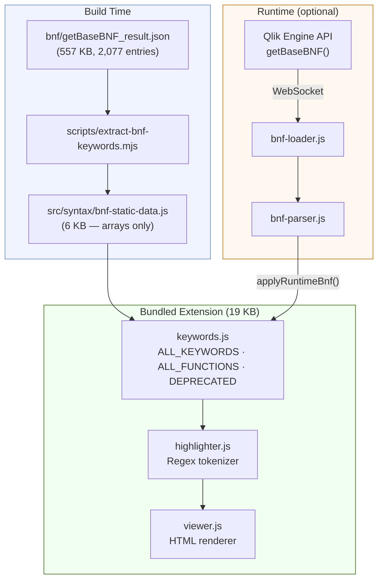
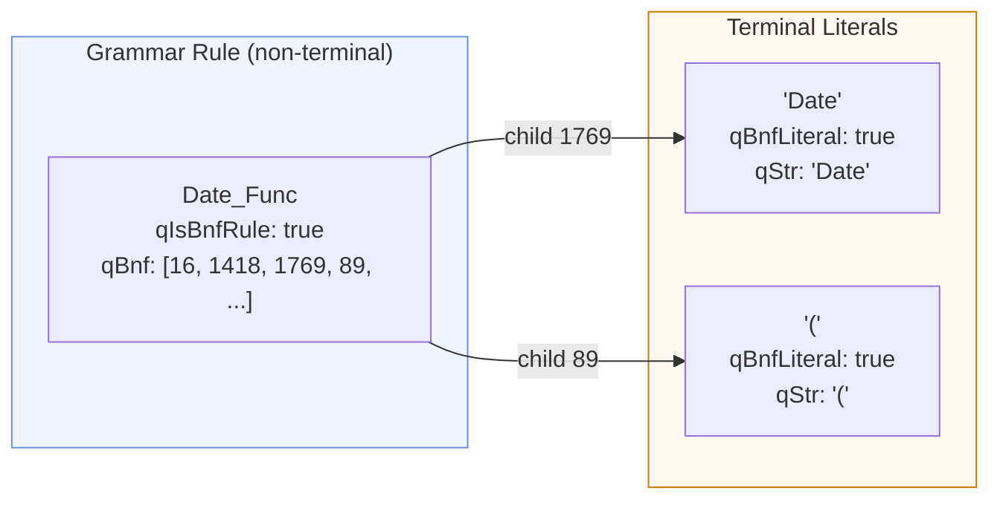
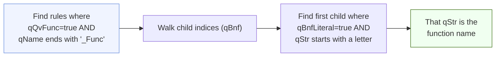
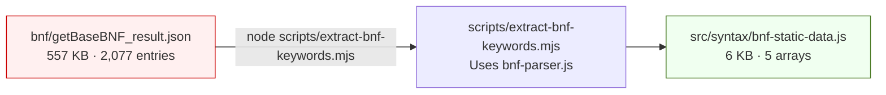
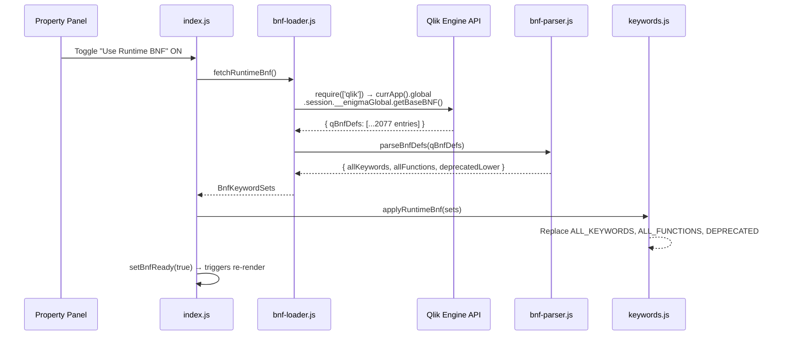
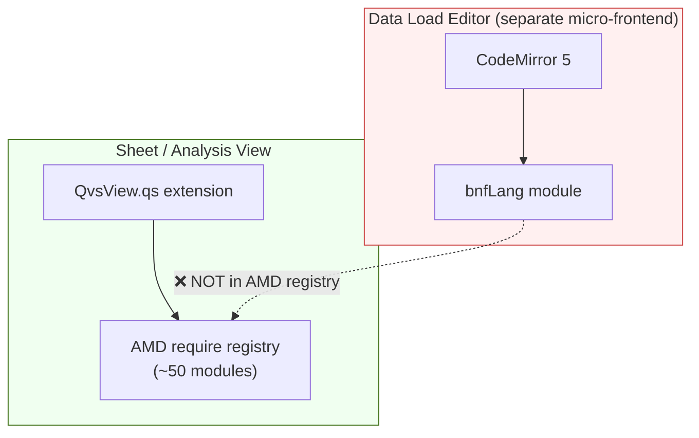
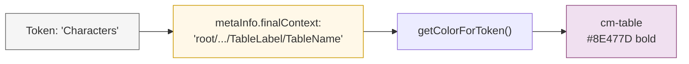
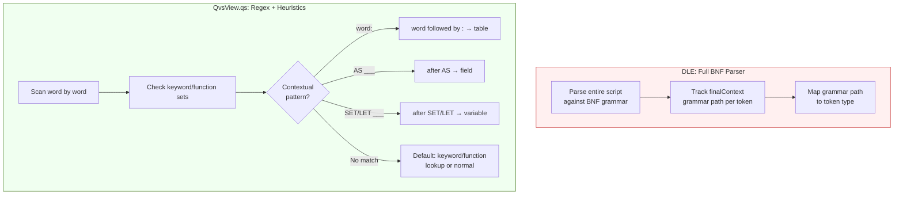
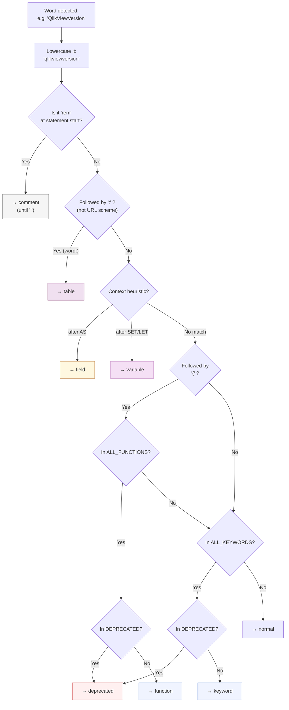

# BNF Parsing Methodology

How QvsView.qs extracts keyword, function, and deprecated-entry lists from the Qlik Sense BNF grammar — and how those lists drive syntax highlighting at runtime.

---

## Table of Contents

- [Background: What is BNF?](#background-what-is-bnf)
- [Where the BNF Data Comes From](#where-the-bnf-data-comes-from)
- [Architecture Overview](#architecture-overview)
- [The BNF Tree Structure](#the-bnf-tree-structure)
- [Parsing Methodology](#parsing-methodology)
    - [Statement Keywords](#statement-keywords)
    - [Control Keywords](#control-keywords)
    - [Functions](#functions)
    - [Aggregation Functions](#aggregation-functions)
    - [Deprecated Entries](#deprecated-entries)
    - [Sub-Keywords (Manual)](#sub-keywords-manual)
- [Build-Time Extraction](#build-time-extraction)
- [Runtime BNF: When Sense's Engine Is Used](#runtime-bnf-when-senses-engine-is-used)
- [Qlik Sense's Built-In BNF Logic](#qlik-senses-built-in-bnf-logic)
- [Token Types and Visual Styling](#token-types-and-visual-styling)
- [How the Tokenizer Uses Keywords](#how-the-tokenizer-uses-keywords)
- [Examples](#examples)
- [File Reference](#file-reference)

---

## Background: What is BNF?

**BNF** (Backus-Naur Form) is a notation for describing the syntax of a programming language.
It defines _rules_ (also called _productions_) that specify how valid statements can be constructed.

A simple example in BNF style:

```
<load_statement> ::= "Load" <field_list> <source_clause>
<source_clause>  ::= "From" <file_path> | "Resident" <table_name>
```

This says: a `Load` statement starts with the literal word `Load`, followed by a field list, followed by either `From <file_path>` or `Resident <table_name>`.

Qlik Sense uses its own BNF grammar internally to define every valid load script construct — every keyword, function, operator, and syntax rule. This grammar is accessible via the [Qlik Engine API](https://qlik.dev/apis/json-rpc/qix/global/#getbasebnf).

QvsView.qs leverages this grammar as the **single source of truth** for what keywords and functions exist, rather than maintaining the lists by hand.

---

## Where the BNF Data Comes From

Qlik exposes two Engine API methods that return BNF data:

| Method                          | Description                                                                                                              |
| ------------------------------- | ------------------------------------------------------------------------------------------------------------------------ |
| `GetBaseBNF({ qBnfType: 'S' })` | Returns the **base script grammar** — all keywords, functions, operators and syntax rules. This is what QvsView.qs uses. |
| `GetBNF({ qBnfType: 'S' })`     | Returns the **extended grammar** which includes app-specific items (custom variables, etc.)                              |

The `GetBaseBNF` response contains an array of ~2,077 BNF entries (`qBnfDefs`), each representing either a **grammar rule** or a **terminal literal** (an actual keyword/symbol that appears in scripts).

The raw JSON weighs ~557 KB and is stored in the repository at `bnf/getBaseBNF_result.json` for reference.

---

## Architecture Overview



There are **two paths** to populate the keyword lists:

1. **Static (default)** — Pre-extracted arrays baked into the bundle at build time. Zero runtime cost, zero dependencies. Always available.
2. **Runtime (opt-in)** — Fetches live BNF from the Qlik Engine API when the user enables the "Use Runtime BNF" toggle in the property panel. Useful if the Qlik Sense version has newer keywords/functions than the bundled lists.

---

## The BNF Tree Structure

Each entry in the `qBnfDefs` array is an object with these key properties:

| Property            | Type       | Description                                       |
| ------------------- | ---------- | ------------------------------------------------- |
| `qNbr`              | `number`   | Unique index of this entry                        |
| `qPNbr`             | `number`   | Parent entry index                                |
| `qBnf`              | `number[]` | Child entry indices (for rules)                   |
| `qName`             | `string`   | Rule or literal name                              |
| `qStr`              | `string`   | The literal text (for terminal symbols)           |
| `qIsBnfRule`        | `boolean`  | True if this is a grammar rule (non-terminal)     |
| `qBnfLiteral`       | `boolean`  | True if this is a terminal literal                |
| `qScriptStatement`  | `boolean`  | True if this is a script statement keyword        |
| `qControlStatement` | `boolean`  | True if this is a control flow keyword            |
| `qQvFunc`           | `boolean`  | True if this is a Qlik function                   |
| `qAggrFunc`         | `boolean`  | True if this is an aggregation function           |
| `qDepr`             | `boolean`  | True if deprecated                                |
| `qFG`               | `string`   | Function group code (e.g., `DATE`, `STR`, `AGGR`) |

### Literals vs Rules



- A **rule** (like `Date_Func`) is a non-terminal: it describes the _shape_ of a syntax construct but doesn't appear in script text itself.
- A **literal** (like `Date`, `(`) is a terminal: it's an actual character or word that appears in a Qlik script.

The parser's job is to walk the tree and collect the meaningful literal names.

---

## Parsing Methodology

All parsing is performed by `bnf-parser.js` → `parseBnfDefs(qBnfDefs)`. It receives the raw array of BNF entries and returns categorized `Set` objects.

### Statement Keywords

**What they are:** Top-level script commands like `Load`, `Set`, `Let`, `Store`, `SQL`, `Drop`, etc.

**How they're found:** Filter for entries where _all three_ conditions are true:

- `qScriptStatement === true`
- `qBnfLiteral === true`
- `qStr` starts with a letter

```js
qBnfDefs.filter((d) => d.qScriptStatement && d.qBnfLiteral && d.qStr && /^[a-zA-Z]/.test(d.qStr));
```

**Example raw entry:**

```json
{
    "qNbr": 282,
    "qName": "Load",
    "qStr": "Load",
    "qScriptStatement": true,
    "qBnfLiteral": true,
    "qFG": "U"
}
```

**Result:** 47 statement keywords — `Alias`, `Autonumber`, `Binary`, `Connect`, `DIRECT`, `Drop`, `Execute`, `Let`, `Load`, `Qualify`, `Rename`, `Section`, `Select`, `Set`, `SQL`, `Store`, `Trace`, etc.

---

### Control Keywords

**What they are:** Control flow constructs like `If`, `For`, `Sub`, `Switch`, `Do`.

**How they're found:** Same approach as statement keywords, but filtering on `qControlStatement`:

```js
qBnfDefs.filter((d) => d.qControlStatement && d.qBnfLiteral && d.qStr && /^[a-zA-Z]/.test(d.qStr));
```

**Example raw entry:**

```json
{
    "qNbr": 881,
    "qName": "If",
    "qStr": "If",
    "qControlStatement": true,
    "qBnfLiteral": true,
    "qFG": "U"
}
```

**Result:** 21 control keywords — `Call`, `Case`, `Default`, `Do`, `Else`, `ElseIf`, `End`, `EndIf`, `EndSub`, `EndSwitch`, `Exit`, `For`, `If`, `Loop`, `Next`, `Script`, `Sub`, `Switch`, `then`, `until`, `while`.

---

### Functions

**What they are:** Built-in Qlik functions — `Date()`, `Left()`, `If()`, `Num()`, `Floor()`, `RGB()`, `Peek()`, etc.

**How they're found:** Functions require a two-step approach because the function _name_ is a child literal of a _rule_ node:



**Concrete example — `Date()` function:**

1. Find the rule: `{ qName: "Date_Func", qQvFunc: true, qIsBnfRule: true, qBnf: [16, 1418, 1769, 89, ...] }`
2. Walk children: index 16 → `BNF_ALL_START` (skip), index 1418 → `dual` (skip), index **1769** → `{ qStr: "Date", qBnfLiteral: true }` ✓
3. Extract: `"Date"` is the function name.

As a fallback, also collect entries directly marked `qQvFunc && qBnfLiteral && qStr` (some functions appear as standalone literals rather than rule children).

**Result:** 343 functions across 24 function groups:

| Group  | Count | Examples                                                  |
| ------ | ----- | --------------------------------------------------------- |
| `DATE` | 68    | `Date`, `Year`, `Month`, `Day`, `WeekDay`, `Now`, `Today` |
| `STR`  | 48    | `Left`, `Right`, `Mid`, `Len`, `Trim`, `Upper`, `Lower`   |
| `AGGR` | 90    | `Sum`, `Avg`, `Count`, `Min`, `Max`, `Concat`, `Only`     |
| `CLR`  | 25    | `RGB`, `ARGB`, `Red`, `Green`, `Blue`, `Black`, `White`   |
| `PROB` | 76    | `NormDist`, `ChiDist`, `TDist`, `BetaDist`, `PoissonDist` |
| `RNG`  | 24    | `RangeSum`, `RangeAvg`, `RangeMin`, `RangeMax`            |
| `SYS`  | 18    | `OSUser`, `ComputerName`, `ReloadTime`, `DocumentName`    |
| `CND`  | 12    | `If`, `Alt`, `Pick`, `Match`, `WildMatch`, `Class`        |
| `FILE` | 15    | `FileSize`, `FileTime`, `FileBaseName`, `QvdNoOfRecords`  |
| `LEG`  | 9     | `QlikViewVersion`, `QVUser`, `SysColor` _(deprecated)_    |
| ...    | ...   | ...                                                       |

---

### Aggregation Functions

**What they are:** Functions that aggregate across rows — `Sum()`, `Count()`, `Avg()`, `Max()`, etc. Also includes statistical test functions (`TTest_*`, `ZTest_*`, `Chi2Test_*`, `LinEst_*`).

**How they're found:** Same tree-walk approach as regular functions, but filtering on `qAggrFunc` instead of `qQvFunc`:

```js
const aggrRules = qBnfDefs.filter((d) => d.qAggrFunc && d.qName.endsWith('_Func'));
// then walk children to find the literal name
```

**Result:** 90 aggregation functions.

> **Note:** Aggregation functions are a subset of all functions. The distinction matters because aggregation functions can only appear in certain contexts (chart expressions, `Group By` clauses, `AGGR()` calls), but for _syntax highlighting purposes_ both are colored identically.

---

### Deprecated Entries

**What they are:** Functions and keywords that still work but are officially deprecated by Qlik.

**How they're found:** Filter for entries with `qDepr === true`, then extract the name from either `qStr` (if it's a literal) or `qName`:

```js
for (const d of qBnfDefs) {
    if (!d.qDepr) continue;
    if (d.qStr && /^[a-zA-Z]/.test(d.qStr)) deprecated.add(d.qStr);
    else if (d.qName && /^[a-zA-Z]/.test(d.qName)) deprecated.add(d.qName);
}
```

**Example raw entry:**

```json
{
    "qNbr": 1896,
    "qName": "QlikViewVersion",
    "qStr": "QlikViewVersion",
    "qBnfLiteral": true,
    "qQvFunc": true,
    "qFG": "LEG",
    "qDepr": true,
    "qFGList": ["LEG"]
}
```

Note the function group `"LEG"` (legacy) — most deprecated entries belong to this group.

**Result:** 18 deprecated entries:

| Name                                               | What it was                                           |
| -------------------------------------------------- | ----------------------------------------------------- |
| `CustomConnect`                                    | Statement keyword                                     |
| `filters`                                          | Statement keyword                                     |
| `GetFolderPath`                                    | System function                                       |
| `Inc` / `Incr`                                     | Numeric functions (replaced by `+` operator)          |
| `JsonSetEx`                                        | JSON function (replaced by `JsonSet`)                 |
| `NumAvg`, `NumCount`, `NumMax`, `NumMin`, `NumSum` | Legacy aggregation functions                          |
| `PoissonDensity`                                   | Probability function (replaced by `PoissonFrequency`) |
| `QVUser`, `QlikViewVersion`                        | Legacy system functions (renamed)                     |
| `QlikTechBlue`, `QlikTechGray`                     | Legacy color constants                                |
| `SysColor`                                         | Legacy color function                                 |
| `Year2Date`                                        | Legacy date function (replaced by `YearToDate`)       |

---

### Sub-Keywords (Manual)

Some words appear in Qlik scripts as clauses within statements but are **not** marked as `qScriptStatement` or `qControlStatement` in the BNF. These are contextual sub-keywords like `From`, `Where`, `As`, `Resident`, `Inline`, etc.

The BNF grammar _does_ contain these words as literals inside grammar rules, but they lack the boolean flags that make automatic extraction possible. They're maintained as a manual list in `keywords.js`:

```js
export const SUB_KEYWORDS = new Set([
    'As',
    'Autogenerate',
    'Crosstable',
    'Distinct',
    'Each',
    'Else',
    'Every',
    'Exists',
    'Field',
    'Fields',
    'From',
    'Group',
    'By',
    'Having',
    'In',
    'Inline',
    'Into',
    'Is',
    'Like',
    'Not',
    'On',
    'Or',
    'And',
    'Order',
    'Resident',
    'Table',
    'Tables',
    'To',
    'Using',
    'Where',
    'With',
]);
```

These are merged into `ALL_KEYWORDS` alongside the BNF-extracted statement and control keywords.

---

## Build-Time Extraction

Bundling the full 557 KB BNF JSON into the extension would bloat it from ~19 KB to ~580 KB — unacceptable for a Qlik Sense extension.

Instead, a build-time script extracts only the keyword/function name arrays:



The generated file (`bnf-static-data.js`) contains plain arrays:

```js
// Auto-generated from bnf/getBaseBNF_result.json — do not edit manually.
// Re-generate: node scripts/extract-bnf-keywords.mjs

export const STATEMENT_KEYWORDS = ["Alias","Autonumber","Binary","Comment",...];
export const CONTROL_KEYWORDS = ["Call","Case","Default","Do",...];
export const FUNCTIONS = ["ARGB","Acos","Acosh","AddMonths",...];
export const AGGR_FUNCTIONS = ["Avg","Chi2Test_Chi2",...];
export const DEPRECATED_NAMES = ["CustomConnect","GetFolderPath","Inc",...];
```

These arrays are imported by `keywords.js` and converted to `Set` objects for O(1) lookup.

**When to re-run:** After updating `bnf/getBaseBNF_result.json` (e.g., when a new Qlik Sense version adds functions):

```bash
node scripts/extract-bnf-keywords.mjs
```

---

## Runtime BNF: When Sense's Engine Is Used

The extension can optionally fetch **live** BNF data from the running Qlik Sense engine. This is useful when:

- The Qlik Sense server is a newer version than the bundled BNF data
- New functions/keywords have been added that the static lists don't include

### How It Works



### Access Path

From inside a Qlik Sense extension running in the sheet view:

```
require(['qlik'])
  → qlik.currApp()
    → app.global.session.__enigmaGlobal
      → .getBaseBNF({ qBnfType: 'S' })
```

This uses the **AMD RequireJS** `qlik` module available in the extension context, which exposes the underlying
Enigma.js WebSocket connection to the engine.

### Caching

Results are cached in memory after the first successful fetch. The cache is cleared when the user toggles the setting off, which causes `keywords.js` to revert to the static BNF data.

### When It's NOT Available

| Scenario                                            | Available?  | Reason                                              |
| --------------------------------------------------- | ----------- | --------------------------------------------------- |
| Qlik Sense Enterprise (client-managed) — sheet view | ✅ Yes      | AMD `qlik` module and `__enigmaGlobal` both present |
| Qlik Cloud — sheet view                             | ⚠️ Untested | May use a different API surface                     |
| Nebula dev server (`npm start`)                     | ❌ No       | No Qlik backend connected                           |
| Data Load Editor                                    | N/A         | Extension doesn't run there                         |

The loader gracefully falls back to static data when the API is unavailable — no errors shown to the user.

---

## Qlik Sense's Built-In BNF Logic

Qlik Sense has its own BNF-based tokenizer (`bnfLang`) that powers syntax highlighting in the **Data Load Editor** (DLE). Here's how it compares and why QvsView.qs doesn't use it directly.

### What bnfLang Provides

The DLE uses CodeMirror 5 with a custom `sense-script` mode. The mode object exposes:

| Method                              | Returns               | Description                                    |
| ----------------------------------- | --------------------- | ---------------------------------------------- |
| `parseTextIntoColorStructure(text)` | `[[text, type], ...]` | Tokenizes text into `[text, tokenType]` tuples |
| `parseIntoTokens(text)`             | Token stream          | Lower-level token iterator                     |
| `getNextToken_Line(state)`          | Next token            | Line-by-line stateful tokenizer                |

Token types from bnfLang: `keyword`, `function`, `operator`, `field`, `normalText`, `variable`, `string`, `comment`, `number`, `error`, `posterror`, `template`.

### Why QvsView.qs Can't Use It



The `bnfLang` module is **only loaded in the DLE micro-frontend**. It's not registered in the AMD module registry accessible from the sheet view where extensions run. Attempting `require(['bnfLang'])` from an extension returns `undefined`.

This was confirmed via live Playwright exploration of both contexts:

- DLE: `bnfLang` found on `editor.getMode()` — 364 AMD modules registered
- Sheet view: `bnfLang` not found — only ~50 AMD modules registered

### How bnfLang Actually Works

Despite being minified, Playwright inspection of the DLE revealed that bnfLang is a **recursive-descent parser** — not a simple regex tokenizer. It tracks the full grammar context for every token.

#### Key Methods

| Method                                 | Purpose                                               |
| -------------------------------------- | ----------------------------------------------------- |
| `parseTextIntoColorStructure(text)`    | High-level: returns `[[text, tokenType], ...]` tuples |
| `parseIntoTokens(text)`                | Returns rich token objects with `metaInfo`            |
| `getNextToken_Line(state)`             | Line-by-line stateful tokenizer using advance lists   |
| `analyzeNextTokenAfter(token)`         | Determines valid continuations from grammar rules     |
| `getIdentifiers()`                     | Extracts all identifier tokens from parsed result     |
| `getPossibleAdvancesAfterToken(token)` | Powers autocomplete suggestions in the DLE            |

#### The `finalContext` Mechanism

Each token produced by `parseIntoTokens()` carries a `metaInfo` object with a `finalContext` string — a **full grammar path** describing exactly where the token sits in the BNF parse tree:

```
"Characters"  → finalContext: "root/LoadStatement/LoadPrefixOrLabel/TableLabel/TableName"
"Alpha"       → finalContext: "root/LoadStatement/FieldList/FieldListFieldOrStar/Field/FieldRef"
"MyField"     → finalContext: "root/LoadStatement/FieldList/.../Field/FieldRefAlias"
"ThousandSep" → finalContext: "root/SetStatement/VariableName"
"Load"        → finalContext: "root/LoadStatement"
"as"          → finalContext: "root/LoadStatement/FieldList/FieldListFieldOrStar/Field"
```

A module-level `getColorForToken()` function maps these grammar paths to CSS token types:



This is how the DLE colors the **same word differently** depending on its grammatical role:

| Word         | As table label                           | As field name                                | As plain identifier                                  |
| ------------ | ---------------------------------------- | -------------------------------------------- | ---------------------------------------------------- |
| `Characters` | `Characters:` → **table** (#8E477D bold) | `Load Characters` → **field** (#CC9966 bold) | `Set Characters = ...` → **variable** (#CC99CC bold) |

#### BNF Object Structure

The bnfLang module holds the parsed BNF grammar in a structured object:

- `bnf.tree` — The full parse tree with nodes containing `nbr`, `tags`, `items`, `name`
- `bnf.namedRules` — Named grammar rules: `IDENTIFIER`, `LITERAL_STRING`, `LITERAL_FIELD`, `LITERAL_NUMBER`, `WHITESPACE`, operators
- `bnf.statementRules` — 15 top-level statement types (LOAD, SELECT, SET, LET, etc.)
- `bnf.controlRules` — Control flow rules (IF, FOR, DO, SUB, etc.)

#### Token Metadata Fields

Each token from `parseIntoTokens()` includes:

| Field                   | Type    | Description                                                  |
| ----------------------- | ------- | ------------------------------------------------------------ |
| `text`                  | string  | The token text                                               |
| `tokenType`             | string  | CSS class name (keyword, function, field, table, etc.)       |
| `pos`                   | number  | Character offset in the input                                |
| `isInteresting`         | boolean | Whether the token is semantically meaningful                 |
| `metaInfo.finalContext` | string  | Full grammar path (e.g., `root/LoadStatement/.../TableName`) |
| `metaInfo.rulesTrail`   | array   | Breadcrumb trail of grammar rules traversed                  |
| `metaInfo.isFunction`   | boolean | Token is a known function                                    |
| `metaInfo.isKeyword`    | boolean | Token is a keyword                                           |
| `metaInfo.isOperator`   | boolean | Token is an operator                                         |
| `metaInfo.isText`       | boolean | Token is a string literal                                    |
| `metaInfo.isError`      | boolean | Token represents a parse error                               |

### What QvsView.qs Uses Instead

QvsView.qs uses a **custom regex-based tokenizer** (`highlighter.js`) with keyword lists populated from the same BNF grammar that `bnfLang` uses. This gives us:

- ✅ The same keyword/function/deprecated classification
- ✅ Works in any context (sheet view, Qlik Cloud, nebula dev server)
- ❌ No full BNF-aware parsing (doesn't understand nesting or statement structure)
- ❌ Some edge cases handled differently (e.g., context-dependent keywords)

---

## Context-Free vs Context-Aware Parsing

This is the fundamental difference between QvsView.qs and the Qlik Sense Data Load Editor.

### The Core Distinction

| Approach          | Used By                       | Classification Method                                                                               | Accuracy                                                        |
| ----------------- | ----------------------------- | --------------------------------------------------------------------------------------------------- | --------------------------------------------------------------- |
| **Context-free**  | QvsView.qs (`highlighter.js`) | Classifies words by **name**: "Is this word in the keyword list?"                                   | Exact for keywords/functions; misses role-dependent coloring    |
| **Context-aware** | DLE (`bnfLang`)               | Classifies words by **grammar position**: "What role does this word play in the current statement?" | Full accuracy — every token colored by its grammatical function |

### Same Word, Different Colors

Consider the identifier `Characters` in three different contexts:

```qlik
Characters:                       // ← Table label (purple #8E477D bold)
Load Characters, Num From ...     // ← Field name (tan #CC9966 bold)
Set Characters = 'abc';           // ← Variable name (purple #CC99CC bold)
```

The DLE's bnfLang parser tracks the grammar path for each token and knows:

- After a LOAD prefix position → it's a **table label**
- Inside a LOAD field list → it's a **field reference**
- After SET → it's a **variable name**

QvsView.qs's regex tokenizer sees `Characters` as an unknown identifier in all three cases and colors it as **normal** (black) — because it's not in any keyword or function list.

### QvsView.qs Heuristics

While full BNF-aware parsing would require a fundamental rewrite (bnfLang is ~15,000 lines of minified code), simple **pattern-based heuristics** can approximate ~80–90% of the visible color diversity:



The three heuristics cover:

| Pattern        | Detects               | DLE Token Type          | Example                           |
| -------------- | --------------------- | ----------------------- | --------------------------------- |
| `word:`        | Table labels          | table (#8E477D bold)    | `Characters:`, `Transactions:`    |
| `AS word`      | Field aliases         | field (#CC9966 bold)    | `as ConvertedSales`, `as MyField` |
| `SET/LET word` | Variable declarations | variable (#CC99CC bold) | `SET ThousandSep`, `LET vYear`    |

### What's NOT Covered

These cases require full grammar tracking and are **not** detected by heuristics:

- **Unaliased field names** in LOAD field lists: `Load CustomerID, Region` — the DLE colors `CustomerID` and `Region` as fields, but QvsView sees them as plain identifiers
- **Function arguments** that are field references: `Sum(Sales)` — `Sales` is a field in DLE but `normal` in QvsView
- **Nested statement contexts**: The grammatical role of a word inside a subquery vs. the outer query
- **Template strings** and **declared measures** (rare in typical scripts)

This is an acceptable trade-off: the heuristics add the most visually impactful colors (table labels are prominent, aliases and SET/LET variables are very common) while keeping the tokenizer simple, fast, and portable.

---

## Token Types and Visual Styling

The tokenizer classifies each piece of text into one of these types:

| Token Type   | Color                                              | Style                        | Example                                       |
| ------------ | -------------------------------------------------- | ---------------------------- | --------------------------------------------- |
| `keyword`    | <span style="color:#6A8FDE">**#6A8FDE**</span>     | **Bold**                     | `Load`, `Set`, `Let`, `From`, `Where`         |
| `function`   | <span style="color:#6A8FDE">**#6A8FDE**</span>     | **Bold**                     | `Date()`, `Left()`, `Sum()`, `If()`           |
| `deprecated` | <span style="color:#6A8FDE">~~**#6A8FDE**~~</span> | **Bold + ~~Strikethrough~~** | `QlikViewVersion()`, `Year2Date()`            |
| `table`      | <span style="color:#8E477D">**#8E477D**</span>     | **Bold**                     | `Characters:`, `Transactions:` (table labels) |
| `field`      | <span style="color:#CC9966">**#CC9966**</span>     | **Bold**                     | `[Sales Amount]`, `as MyField`                |
| `variable`   | <span style="color:#CC99CC">**#CC99CC**</span>     | **Bold**                     | `$(vYear)`, `SET ThousandSep`                 |
| `string`     | <span style="color:#44751D">#44751D</span>         | Normal                       | `'hello'`, `"world"`                          |
| `comment`    | <span style="color:#808080">_#808080_</span>       | _Italic_                     | `// line comment`, `/* block */`, `REM ...;`  |
| `number`     | <span style="color:#3A7391">#3A7391</span>         | Normal                       | `42`, `3.14`                                  |
| `operator`   | #000000                                            | Normal                       | `+`, `-`, `*`, `=`, `;`                       |
| `normal`     | #000000                                            | Normal                       | Unrecognized identifiers, whitespace          |

Colors are based on the Qlik Sense Data Load Editor's CodeMirror theme.

---

## How the Tokenizer Uses Keywords

The regex tokenizer in `highlighter.js` processes each line character by character. When it encounters a word (letters, digits, `_`, `#`, `.`), it classifies it:



Key decisions:

1. A word followed by `(` is checked as a **function** first, then as a keyword. This prevents `If` from being colored as a function when used as a control keyword (`If condition Then ...`), while still coloring `If(condition, then, else)` as a function.
2. **Table label** detection: `word:` but not `http://` or `https://` — URL scheme prefixes are excluded.
3. **Context heuristics** (AS → field, SET/LET → variable) only apply to the **next non-whitespace word** after the keyword, then the context resets.

---

## Examples

### Keywords

```qlik
Load
    CustomerID,
    CustomerName,
    Region
From [lib://DataFiles/Customers.csv]
(txt, codepage is 28591, embedded labels, delimiter is ',', msq);
```

| Token                             | Type    | Why                                                        |
| --------------------------------- | ------- | ---------------------------------------------------------- |
| `Load`                            | keyword | In `STATEMENT_KEYWORDS`, flagged `qScriptStatement` in BNF |
| `From`                            | keyword | In `SUB_KEYWORDS` (manual list)                            |
| `[lib://DataFiles/Customers.csv]` | field   | Square-bracket delimited                                   |
| `CustomerID`                      | normal  | Not in any keyword/function set                            |

### Functions

```qlik
Let vToday = Date(Today(), 'YYYY-MM-DD');
Let vYear = Year(Today());
```

| Token          | Type     | Why                                             |
| -------------- | -------- | ----------------------------------------------- |
| `Let`          | keyword  | In `STATEMENT_KEYWORDS`                         |
| `vToday`       | variable | After `Let` keyword → variable name (heuristic) |
| `Date`         | function | In `FUNCTIONS`, followed by `(`                 |
| `Today`        | function | In `FUNCTIONS`, followed by `(`                 |
| `vYear`        | variable | After `Let` keyword → variable name (heuristic) |
| `Year`         | function | In `FUNCTIONS`, followed by `(`                 |
| `'YYYY-MM-DD'` | string   | Single-quoted                                   |

### Deprecated Functions

```qlik
Let vVersion = QlikViewVersion();
Let vFolder = GetFolderPath();
Let vOldTotal = NumSum(Amount);
```

| Token             | Type       | Rendered as                                    |
| ----------------- | ---------- | ---------------------------------------------- |
| `QlikViewVersion` | deprecated | ~~**QlikViewVersion**~~ (strikethrough + bold) |
| `GetFolderPath`   | deprecated | ~~**GetFolderPath**~~                          |
| `NumSum`          | deprecated | ~~**NumSum**~~                                 |

The strikethrough styling immediately signals to the script author that these functions should be replaced with their modern equivalents (`ProductVersion`, `DocumentPath`, `Sum`).

### Variables and Fields

```qlik
Load
    [Sales Amount] * $(vExchangeRate) as ConvertedSales,
    $(=MonthName(Today())) as CurrentMonth
Resident SalesTable;
```

| Token                    | Type     | Why                                          |
| ------------------------ | -------- | -------------------------------------------- |
| `[Sales Amount]`         | field    | Square brackets → field reference            |
| `$(vExchangeRate)`       | variable | Dollar-sign expansion                        |
| `$(=MonthName(Today()))` | variable | Dollar-sign expression expansion             |
| `ConvertedSales`         | field    | After `as` keyword → field alias (heuristic) |
| `CurrentMonth`           | field    | After `as` keyword → field alias (heuristic) |
| `Resident`               | keyword  | In `SUB_KEYWORDS`                            |

### Table Labels

```qlik
Characters:
Load Chr(RecNo()+Ord('A')-1) as Alpha, RecNo() as Num
Autogenerate 26;
```

| Token        | Type     | Why                                                  |
| ------------ | -------- | ---------------------------------------------------- |
| `Characters` | table    | Identifier followed by `:` → table label (heuristic) |
| `Chr`        | function | In `FUNCTIONS`, followed by `(`                      |
| `RecNo`      | function | In `FUNCTIONS`, followed by `(`                      |
| `Ord`        | function | In `FUNCTIONS`, followed by `(`                      |
| `Alpha`      | field    | After `as` keyword → field alias (heuristic)         |
| `Num`        | field    | After `as` keyword → field alias (heuristic)         |

### SET/LET Variable Declarations

```qlik
SET ThousandSep = ',';
SET DecimalSep = '.';
LET vToday = Date(Today(), 'YYYY-MM-DD');
```

| Token         | Type     | Why                                             |
| ------------- | -------- | ----------------------------------------------- |
| `SET`         | keyword  | In `STATEMENT_KEYWORDS`                         |
| `ThousandSep` | variable | After `SET` keyword → variable name (heuristic) |
| `LET`         | keyword  | In `STATEMENT_KEYWORDS`                         |
| `vToday`      | variable | After `LET` keyword → variable name (heuristic) |
| `Date`        | function | In `FUNCTIONS`, followed by `(`                 |
| `Today`       | function | In `FUNCTIONS`, followed by `(`                 |

### Comments

```qlik
// This is a line comment
/* This is a
   block comment */
REM This is a REM comment;
Set vNote = 'not a comment';  // trailing comment
```

| Token                        | Type    | Why                                     |
| ---------------------------- | ------- | --------------------------------------- |
| `// This is a line comment`  | comment | Starts with `//`                        |
| `/* ... */`                  | comment | Block delimiters, stateful across lines |
| `REM This is a REM comment;` | comment | `REM` keyword until `;`                 |
| `'not a comment'`            | string  | Inside quotes — not affected by `//`    |
| `// trailing comment`        | comment | After the string/semicolon              |

---

## File Reference

| File                               | Purpose                                                    |
| ---------------------------------- | ---------------------------------------------------------- |
| `bnf/getBaseBNF_result.json`       | Raw BNF data from `GetBaseBNF` (reference, not bundled)    |
| `scripts/extract-bnf-keywords.mjs` | Build-time extraction script                               |
| `src/syntax/bnf-static-data.js`    | Auto-generated keyword arrays (bundled)                    |
| `src/syntax/bnf-parser.js`         | Parses raw BNF entries into categorized sets               |
| `src/syntax/bnf-loader.js`         | Runtime BNF fetcher via Engine API                         |
| `src/syntax/keywords.js`           | Exports `ALL_KEYWORDS`, `ALL_FUNCTIONS`, `DEPRECATED` sets |
| `src/syntax/highlighter.js`        | Regex tokenizer that consumes the keyword sets             |
| `src/syntax/tokens.js`             | Token type → CSS color/style mapping                       |
| `src/index.js`                     | Supernova entry — manages runtime BNF lifecycle            |
| `src/ext/viewer-section.js`        | Property panel toggle for runtime BNF                      |
