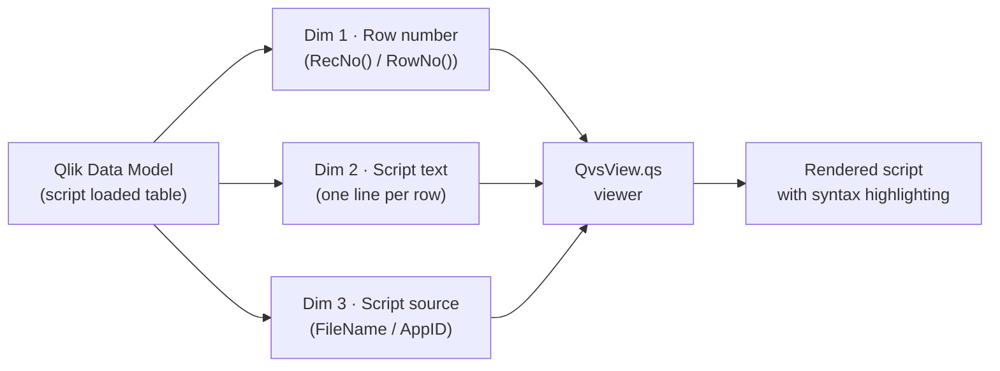
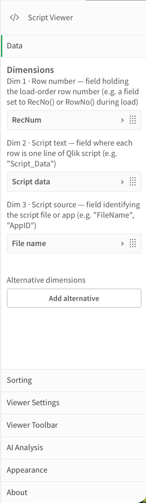
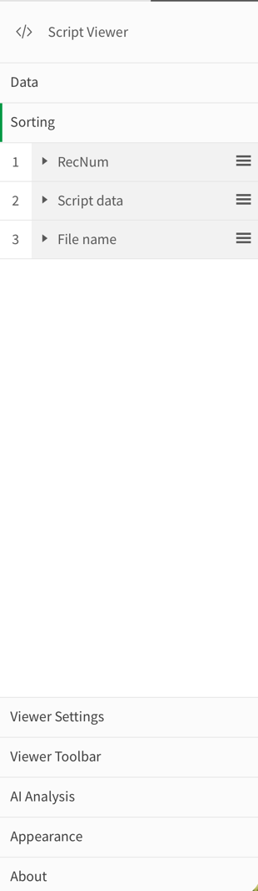
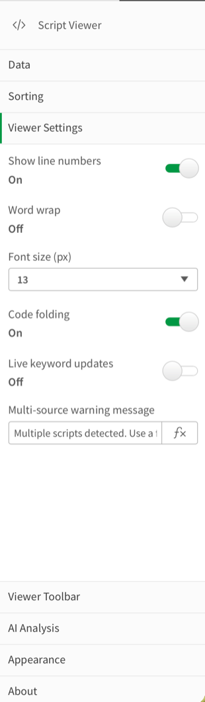
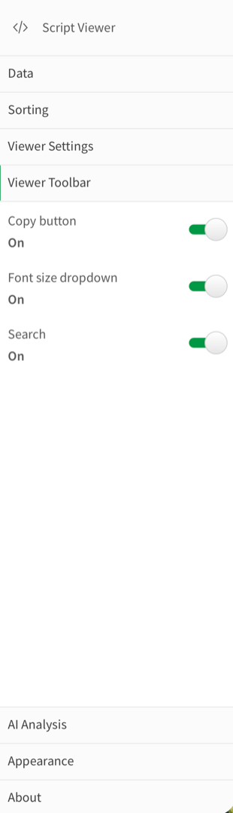
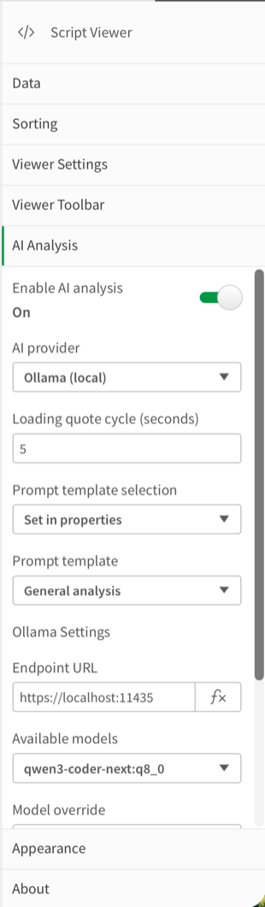
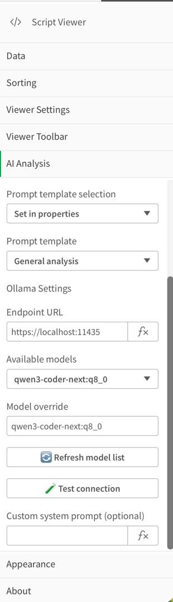
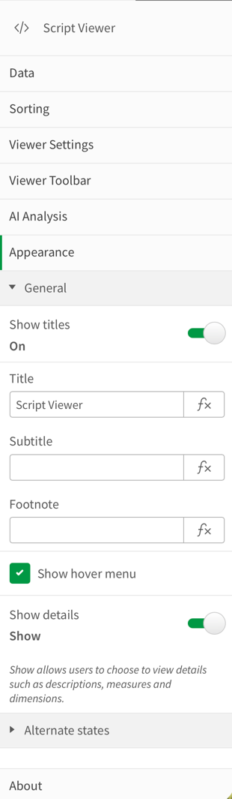
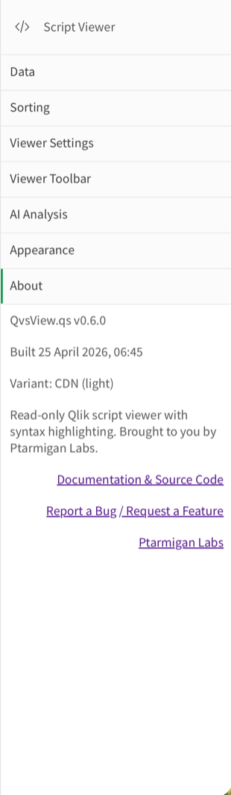

# Configuration Settings Reference

This page describes every setting available in the QvsView.qs property panel. Open the panel in Qlik Sense edit mode by right-clicking the visualization and choosing **Edit**.

The property panel is organized as a collapsible accordion. Each section is described below in the order it appears.

---

## Contents

- [Data](#data)
- [Sorting](#sorting)
- [Viewer Settings](#viewer-settings)
- [Viewer Toolbar](#viewer-toolbar)
- [AI Analysis](#ai-analysis)
- [Appearance](#appearance)
- [About](#about)

---

## Data

### How the three dimensions work

QvsView.qs uses a **hypercube with exactly three dimensions**. All three are required — the viewer will not render correctly if fewer than three are added, and the Qlik engine prevents adding more than three.

<table>
<tr>
<td valign="top">

</td>
<td valign="top">

| #   | Label             | Purpose                                                                                                                                                  | Typical field                                                             |
| --- | ----------------- | -------------------------------------------------------------------------------------------------------------------------------------------------------- | ------------------------------------------------------------------------- |
| 1   | **Row number**    | Load-order line number. Sorting this dimension numerically ascending preserves the original script line sequence. Must be a numeric field.               | A field populated with `RecNo()` or `RowNo()` during the data load script |
| 2   | **Script text**   | The actual content of each script line. Each row in the field holds exactly one line of Qlik script.                                                     | e.g. `Script_Data`                                                        |
| 3   | **Script source** | Identifies which script file or app each line came from. Used for multi-source filtering when the data model contains scripts from more than one source. | e.g. `FileName`, `AppID`                                                  |

> **Tip:** The **Alternative dimensions** area below the three required dimensions is a standard Qlik control that lets you define dimensions users can switch between at runtime. It is not specific to QvsView.qs.

</td>
</tr>
</table>

---

## Sorting

<table>
<tr>
<td valign="top">

</td>
<td valign="top">

When you add the **Row number** dimension (Dim 1), the extension automatically configures it to sort **numerically ascending**. This ensures that the viewer displays lines in the same order they were loaded — preserving the original script sequence.

> **Important:** Changing the sort order of the Row number dimension will scramble the displayed script. Leave the default numeric-ascending sort in place unless you have a specific reason to change it.
>
> The sort settings for Dim 2 (Script text) and Dim 3 (Script source) have no meaningful effect on the viewer output, because the viewer assembles lines based on the row-number sort.

</td>
</tr>
</table>

---

## Viewer Settings

<table>
<tr>
<td valign="top">

</td>
<td valign="top">

Controls the visual presentation of the script viewer.

| Setting                          | Default      | Description                                                                                                                                                                                                                                                                                          |
| -------------------------------- | ------------ | ---------------------------------------------------------------------------------------------------------------------------------------------------------------------------------------------------------------------------------------------------------------------------------------------------- |
| **Show line numbers**            | On           | Displays a gutter on the left side of the viewer showing the line number of each script line. Turn off for a cleaner look when line references are not needed.                                                                                                                                       |
| **Word wrap**                    | Off          | When enabled, long lines that exceed the viewer width wrap onto the next visual line instead of requiring horizontal scrolling. Useful when working on a narrow chart or with long LOAD statements.                                                                                                  |
| **Font size (px)**               | 13           | Sets the font size used to render script text. Available sizes: 10, 11, 12, 13, 14, 16, 18, 20 pixels.                                                                                                                                                                                               |
| **Code folding**                 | On           | Adds collapse/expand controls next to multi-line code blocks. Foldable regions include: LOAD/SELECT statements, SUB/END SUB, IF/END IF, FOR/NEXT loops, and block comments. Turn off to remove the fold gutter entirely.                                                                             |
| **Live keyword updates**         | Off          | When enabled, fetches the keyword and function lists directly from the Qlik Engine at runtime, ensuring that syntax highlighting stays in sync with your Qlik Sense version. When off, uses the built-in keyword list bundled with the extension. Requires a working engine connection at page load. |
| **Multi-source warning message** | _(see note)_ | Message shown in a banner when more than one distinct script source is detected in the data (i.e. Dim 3 returns more than one unique value). Supports Qlik expressions (optional). Default: `Multiple scripts detected. Use a filter to select a single script source.`                              |

</td>
</tr>
</table>

---

## Viewer Toolbar

<table>
<tr>
<td valign="top">

</td>
<td valign="top">

Controls which buttons and controls appear in the toolbar rendered at the top of the viewer.

| Setting                | Default | Description                                                                                                                                                                                                    |
| ---------------------- | ------- | -------------------------------------------------------------------------------------------------------------------------------------------------------------------------------------------------------------- |
| **Copy button**        | On      | Shows a **Copy** button that copies the entire script to the clipboard with a single click. Useful for quickly extracting a script from the viewer for use elsewhere.                                          |
| **Font size dropdown** | Off     | Shows a compact dropdown in the toolbar that lets users change the font size at runtime without entering edit mode. When off, the font size is locked to the value set in [Viewer Settings](#viewer-settings). |
| **Search**             | Off     | Shows a **Search** field in the toolbar, allowing users to search for text within the displayed script in analysis mode.                                                                                       |

</td>
</tr>
</table>

---

## AI Analysis

QvsView.qs includes an optional AI-powered script analysis feature. When enabled, an **Analyze** button appears in the toolbar. Clicking it sends the displayed Qlik script to the configured LLM and renders the response as formatted Markdown with optional Mermaid diagrams.

> See [ai-analysis.md](ai-analysis.md) for a detailed guide to CORS configuration, API key security, and reverse proxy setup.

### Supported providers at a glance

| Provider           | Default endpoint               | Auth             | Best for                 |
| ------------------ | ------------------------------ | ---------------- | ------------------------ |
| **Ollama (local)** | `http://127.0.0.1:11434`       | None required    | Air-gapped / fully local |
| **OpenAI**         | `https://api.openai.com/v1`    | API key (Bearer) | Cloud                    |
| **Anthropic**      | `https://api.anthropic.com/v1` | API key (header) | Cloud                    |

<table>
<tr>
<td valign="top">

</td>
<td valign="top">

</td>
</tr>
</table>

### Enable / Disable

| Setting                | Default | Description                                                                                                     |
| ---------------------- | ------- | --------------------------------------------------------------------------------------------------------------- |
| **Enable AI analysis** | Off     | Master switch. When off, none of the AI settings below are active and no Analyze button appears in the toolbar. |

### General AI settings

These settings appear once AI analysis is enabled, regardless of the chosen provider.

| Setting                           | Default           | Description                                                                                                                                                                                                                                                                                                                                                                             |
| --------------------------------- | ----------------- | --------------------------------------------------------------------------------------------------------------------------------------------------------------------------------------------------------------------------------------------------------------------------------------------------------------------------------------------------------------------------------------- |
| **AI provider**                   | Ollama (local)    | Choose which AI service to use: **Ollama (local)** (no API key required), **OpenAI**, or **Anthropic**. Each choice reveals its own provider-specific settings below.                                                                                                                                                                                                                   |
| **Loading quote cycle (seconds)** | 5                 | While the AI generates a response, the toolbar shows a rotating set of humorous loading quotes. Controls how many seconds each quote is shown before rotating. Range: 3–10 seconds.                                                                                                                                                                                                     |
| **Prompt template selection**     | Set in properties | **Set in properties**: the analysis template is fixed by the setting below and users cannot change it at runtime. **Choose at runtime**: a template picker appears in the toolbar when users click Analyze.                                                                                                                                                                             |
| **Prompt template**               | General analysis  | _(Only shown when template selection is "Set in properties")_ The analytical lens applied to the script: **General analysis** (overall review), **Security audit** (credential exposure, injection risks, hardcoded values), **Performance review** (slow patterns such as large Cartesian joins or inefficient WHERE clauses), **Documentation** (inline documentation and summaries). |

### Provider: Ollama

Shown when **AI provider** is set to _Ollama (local)_.

| Setting                   | Default                  | Description                                                                                                                                                                                                                              |
| ------------------------- | ------------------------ | ---------------------------------------------------------------------------------------------------------------------------------------------------------------------------------------------------------------------------------------- |
| **Endpoint URL**          | `http://127.0.0.1:11434` | The base URL of the Ollama server. Change this if Ollama is running on a different host or port. Supports Qlik expressions (optional).                                                                                                   |
| **Available models**      | `llama3.1`               | A dropdown populated automatically by querying `/api/tags` on the configured endpoint. Select a model to set the active model. If the endpoint is unreachable, the dropdown shows the current model name as a placeholder.               |
| **Model override**        | `llama3.1`               | A free-text field that shares the same underlying value as the _Available models_ dropdown. Type any model name here to use a model that is installed in Ollama but not yet reflected in the dropdown, or to use a custom/private model. |
| **🔄 Refresh model list** | —                        | Button. Clears the cached model list and re-queries the endpoint. Use this after pulling a new model with `ollama pull`.                                                                                                                 |
| **🧪 Test connection**    | —                        | Button. Opens a modal that sends a minimal request to the endpoint and reports whether the connection succeeds.                                                                                                                          |

> **Note on CORS / mixed content:** When Qlik Sense is served over HTTPS and Ollama runs on HTTP (the default), browsers block the request. Set `OLLAMA_ORIGINS` on the Ollama server or run Ollama behind an HTTPS reverse proxy. See [ai-analysis.md](ai-analysis.md) for step-by-step instructions.

### Provider: OpenAI

Shown when **AI provider** is set to _OpenAI_.

| Setting                   | Default                     | Description                                                                                                                                                                                                                                                                                                                 |
| ------------------------- | --------------------------- | --------------------------------------------------------------------------------------------------------------------------------------------------------------------------------------------------------------------------------------------------------------------------------------------------------------------------- |
| **Endpoint URL**          | `https://api.openai.com/v1` | The OpenAI-compatible API base URL. Override to point at a proxy, Azure OpenAI endpoint, or any other OpenAI-compatible service. Supports Qlik expressions (optional).                                                                                                                                                      |
| **Available models**      | `gpt-4o`                    | Populated by querying `/models` on the endpoint with the configured API key. Requires an API key to fetch.                                                                                                                                                                                                                  |
| **Model override**        | `gpt-4o`                    | Free-text field sharing the same value as the dropdown. Enter any model ID not listed in the dropdown.                                                                                                                                                                                                                      |
| **🔄 Refresh model list** | —                           | Re-fetches the model list from the endpoint.                                                                                                                                                                                                                                                                                |
| **🧪 Test connection**    | —                           | Opens a connection test modal.                                                                                                                                                                                                                                                                                              |
| **API key handling**      | Prompt at runtime           | **Prompt at runtime**: the key is requested in a dialog when the user clicks Analyze and stored in `sessionStorage` for the duration of the browser session (not persisted). **Store in properties**: the key is saved inside the Qlik object properties — convenient but visible to anyone with edit access to the object. |
| **API key**               | _(empty)_                   | _(Only shown when API key handling is "Store in properties")_ The OpenAI API key.                                                                                                                                                                                                                                           |

### Provider: Anthropic

Shown when **AI provider** is set to _Anthropic_.

| Setting                   | Default                        | Description                                                                                                                            |
| ------------------------- | ------------------------------ | -------------------------------------------------------------------------------------------------------------------------------------- |
| **Endpoint URL**          | `https://api.anthropic.com/v1` | The Anthropic API base URL. Supports Qlik expressions (optional).                                                                      |
| **Available models**      | `claude-sonnet-4-20250514`     | Populated by querying `/v1/models` with the configured API key. Requires an API key to fetch.                                          |
| **Model override**        | `claude-sonnet-4-20250514`     | Free-text field for entering any Anthropic model ID directly.                                                                          |
| **🔄 Refresh model list** | —                              | Re-fetches the Anthropic model list.                                                                                                   |
| **🧪 Test connection**    | —                              | Opens a connection test modal.                                                                                                         |
| **API key handling**      | Prompt at runtime              | Same behavior as the OpenAI equivalent. **Prompt at runtime** caches in `sessionStorage`; **Store in properties** saves in the object. |
| **API key**               | _(empty)_                      | _(Only shown when API key handling is "Store in properties")_ The Anthropic API key.                                                   |

### Custom system prompt

| Setting                             | Default   | Description                                                                                                                                                                                                                                                                                                                                            |
| ----------------------------------- | --------- | ------------------------------------------------------------------------------------------------------------------------------------------------------------------------------------------------------------------------------------------------------------------------------------------------------------------------------------------------------ |
| **Custom system prompt (optional)** | _(empty)_ | Additional instructions appended to the selected prompt template. Use this to tailor the AI's response style, enforce specific output formats, or provide context about your environment (e.g. "This script runs in a financial reporting app — flag any fields that may contain personally identifiable data"). Supports Qlik expressions (optional). |

---

## Appearance

<table>
<tr>
<td valign="top">

</td>
<td valign="top">

The Appearance section is a standard Qlik Sense accordion provided by the nebula.js framework. It controls the visual chrome around the visualization object.

| Setting              | Description                                                                                                                   |
| -------------------- | ----------------------------------------------------------------------------------------------------------------------------- |
| **Show titles**      | Toggle the title bar above the chart on or off.                                                                               |
| **Title**            | The title displayed in the title bar and in sheet thumbnails. Defaults to `Script Viewer`.                                    |
| **Subtitle**         | Optional secondary line of text below the title.                                                                              |
| **Footnote**         | Optional text rendered below the visualization, useful for source attributions or data refresh timestamps.                    |
| **Show hover menu**  | Show or hide the kebab (⋮) hover menu that appears when a user moves the pointer over the object in analysis mode.            |
| **Show details**     | Show or hide the **Details** toggle that lets users expand the subtitle/footnote area.                                        |
| **Alternate states** | Assigns the object to a Qlik alternate state, enabling comparative analysis across multiple selection states in the same app. |

</td>
</tr>
</table>

---

## About

<table>
<tr>
<td valign="top">

</td>
<td valign="top">

The About section is read-only and provides version and build information for the installed extension, as well as links to external resources.

| Item                                 | Description                                                                                                                                                                  |
| ------------------------------------ | ---------------------------------------------------------------------------------------------------------------------------------------------------------------------------- |
| **Version**                          | The installed version of QvsView.qs (e.g. `QvsView.qs v1.2.0`).                                                                                                              |
| **Build date**                       | The date and time the extension bundle was compiled.                                                                                                                         |
| **Variant**                          | Indicates whether the installed build is **Air-gapped (full)** (all assets bundled, no CDN required) or **CDN (light)** (loads some assets from a content delivery network). |
| **Description**                      | A short description of the extension and its author.                                                                                                                         |
| **Documentation & Source Code**      | Link to the GitHub repository: [github.com/ptarmiganlabs/QvsView.qs](https://github.com/ptarmiganlabs/QvsView.qs).                                                           |
| **Report a Bug / Request a Feature** | Link to the GitHub Issues new-issue page for bug reports and feature requests.                                                                                               |
| **Ptarmigan Labs**                   | Link to [ptarmiganlabs.com](https://ptarmiganlabs.com), the creator of QvsView.qs.                                                                                           |

</td>
</tr>
</table>
