# Getting Started with QvsView.qs

This guide walks you through setting up and using QvsView.qs to analyze Qlik Sense load scripts across your environment.

> **Scope**: This guide focuses on **Qlik Sense Enterprise on Windows** (client-managed). The extension also installs on Qlik Sense Cloud, but the data pipeline for getting scripts into Cloud is more complex and not covered here.

---

## 1. Install the Extension

The extension is distributed as a ZIP file that you import into the Qlik Management Console (QMC).

### Download

1. Go to [**Releases**](https://github.com/ptarmiganlabs/QvsView.qs/releases) and download a variant:
    - `qvsview-qs-v{X.X.X}-cdn.zip` — if your Sense server has internet access
    - `qvsview-qs-v{X.X.X}-airgap.zip` — for air-gapped environments

2. Extract the downloaded ZIP. Inside you'll find:
    - `qvsview-qs.zip` — the actual extension file to upload

### Import in QMC

1. Open the **Qlik Management Console** → **Extensions**.
2. Click **Import** and select `qvsview-qs.zip`.
3. Open any app in the Sense hub, enter edit mode, and drag **QvsView.qs** from the custom objects panel onto a sheet.

---

## 2. Extract Scripts from Sense Apps

Before the extension can display scripts, you need to extract them from your Sense apps into `.qvs` files. This project includes extraction scripts that use [Ctrl-Q](https://ctrl-q.ptarmiganlabs.com/) — a command-line tool for Qlik Sense (Just like QvsView.qs, Ctrl-Q is created by [Ptarmigan Labs](https://ptarmiganlabs.com/) and is open source).

### Scripts Location

| Platform      | Script                                                       | Description          |
| ------------- | ------------------------------------------------------------ | -------------------- |
| macOS / Linux | `tool/extract-app-scripts/bash/extract_scripts_cm.sh`        | Bash script          |
| Windows       | `tool/extract-app-scripts/powershell/extract_scripts_cm.ps1` | PowerShell 7+ script |

### Configure the Script

Edit the configuration section at the top of the script:

```bash
# === Qlik Sense Connection ===
QS_HOST="qlikserver.domain.com"
QS_PORT="4242"                   # QRS API port
QS_ENGINE_PORT="4747"           # Engine port
QS_VIRTUAL_PROXY=""             # Optional: "/qvd"
QS_AUTH_TYPE="cert"             # "cert" or "sense"
QS_CERT_FILE="./cert/client.pem"
QS_CERT_KEY_FILE="./cert/client_key.pem"
QS_ROOT_CERT_FILE="./cert/root.pem"
INSECURE_SSL=false              # Set true for self-signed certs

# === Ctrl-Q Tool ===
CTRLQ_BIN="/path/to/ctrl-q"

# === Output ===
DEST_ROOT="./output"
ENABLE_TIMESTAMP_FOLDER=true
ENABLE_LATEST_FOLDER=true
```

> **Tip**: Check the [Ctrl-Q documentation](https://ctrl-q.ptarmiganlabs.com/docs/command/qseow/app-script/) for details on the `app-script` command used internally.

### Run the Extraction

```bash
# macOS / Linux
cd tool/extract-app-scripts/bash
./extract_scripts_cm.sh

# Windows
cd tool/extract-app-scripts/powershell
pwsh ./extract_scripts_cm.ps1
```

### Output Structure

```
output/
├── 2026-04-25_120000/              # Timestamped folder
│   ├── app_mapping.csv              # appId, appName, file_name
│   ├── App_1_abc123.qvs
│   ├── App_2_def456.qvs
│   └── ...
├── latest/                         # Copy of latest run
│   ├── app_mapping.csv
│   └── ...
```

### Extraction Flow

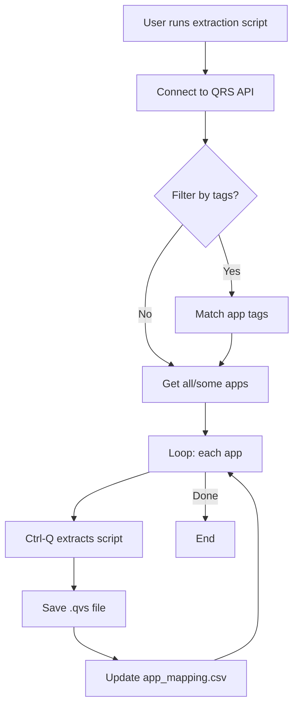

> For detailed instructions and troubleshooting, see [tool/extract-app-scripts/README.md](../tool/extract-app-scripts/README.md).

---

## 3. Create a Load Script to Load .qvs Files

Once you have extracted the `.qvs` files, create a Qlik Sense load script to load them into a Sense app (where the QvsView extension will read them).

### Demo Load Script

```qlik
// Do not strip leading and trailing space etc.
// https://help.qlik.com/en-US/sense/November2025/Subsystems/Hub/Content/Sense_Hub/Scripting/SystemVariables/Verbatim.htm
SET Verbatim = 1;

// Table holding all loaded .qvs files' script lines
ScriptLines:
LOAD
    RecNo() as [Row number],
    @1:n AS [Script data],
    FileName() AS [File name]
FROM [lib://Scripts data connection/path/to/qvs/files/*.qvs]
(fix, utf8, no labels, msq);

// Set back to default
SET Verbatim = 0;


// Table holding mapping between .qvs file name and app ID/name
Apps:
LOAD
    app_id as [App ID],
    app_name as [App name],
    file_name as [File name]
FROM [lib://Scripts data connection/path/to/qvs/files/app_mapping.csv]
(txt, utf8, embedded labels, delimiter is ',', msq);
```

### Adapt the File Path

**Important**: Update the path in the `FROM` statements to match where you stored the extracted `.qvs` files in your Sense environment:

1. Create a **data connection** in the QMC (or use an existing one)
2. Replace `lib://Scripts data connection/path/to/qvs/files/*.qvs` with your actual data connection path

For example:

```
FROM [lib://MyScripts/CustomerScripts/*.qvs]
```

### Why `SET Verbatim = 1`?

This system variable preserves whitespace in the loaded script lines, ensuring that indentation and spacing in the original script are maintained when displayed in the viewer.

---

## 4. Typical Usage Scenario

This section walks through a common workflow: analyzing script patterns across many Sense apps.

### The Situation

Your environment has hundreds or thousands of Sense apps developed over time by different developers. You want to:

- Get an overview of how scripts are structured across apps
- Identify which apps have similar - but not identical - field naming (e.g., "country", "Country", "CountryName")
- Find specific patterns (e.g., how "country" is referenced) without opening each app manually

### Step-by-Step

#### Step 1: Add the QvsView Extension to a Sheet

1. Place the QvsView extension on a sheet in your analysis app.
2. Open the **property panel** → **Data**.
3. Add a **Dimension** for the row number field within each .qvs file.
4. Add **second dimension** for the script line (`Script data` field). This is the field containing the actual script lines extracted from the .qvs files.
5. Add a **third dimension** for the script identifier field (`File name` or `App name`, depending on your preference). This field should be a identifier that uniquely identifies each script file.

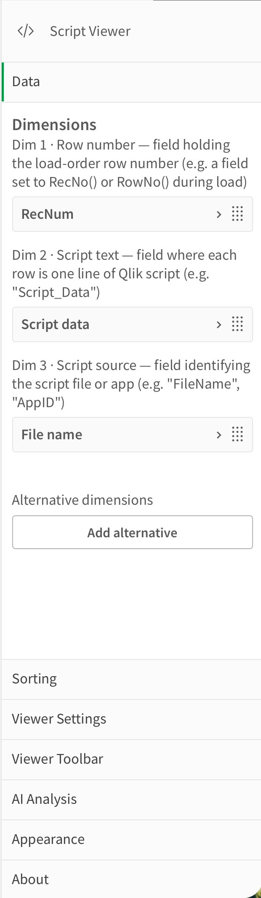

#### Step 2: Search Across All Scripts

Create a filter pane with the needed fields in it.  
Type a search phrase — for example, `country` - in the "Script data" field of the filter pane.

The search immediately shows you (in the "File name" field in the filter pane) which apps contain the search phrase.

If there is more than one file containing the search phrase, the script viewer will show you the names of the 5 first matching files, plus a total count of how many files contain the search phrase.

Here it is getting interesting, because you can immediately see if there are variations in how the search phrase is used across the different apps.  
For example, you may find that some scripts use "country", while others use "Country", "CountryName", "Country_Name" etc. This can be an indication that there are inconsistencies in how the data model is structured across the different apps.

Select one of the files and the viewer will show the scipt of that file.

> **Note**: The script viewer will only show script lines when ONE file is selected.

#### Step 3: Search within the script

Once a single file is selected and the script visible in the viewer, click somewhere within the viewer (to give it focus) and press **Ctrl+F** (or **Cmd+F** on macOS) to open the search bar.

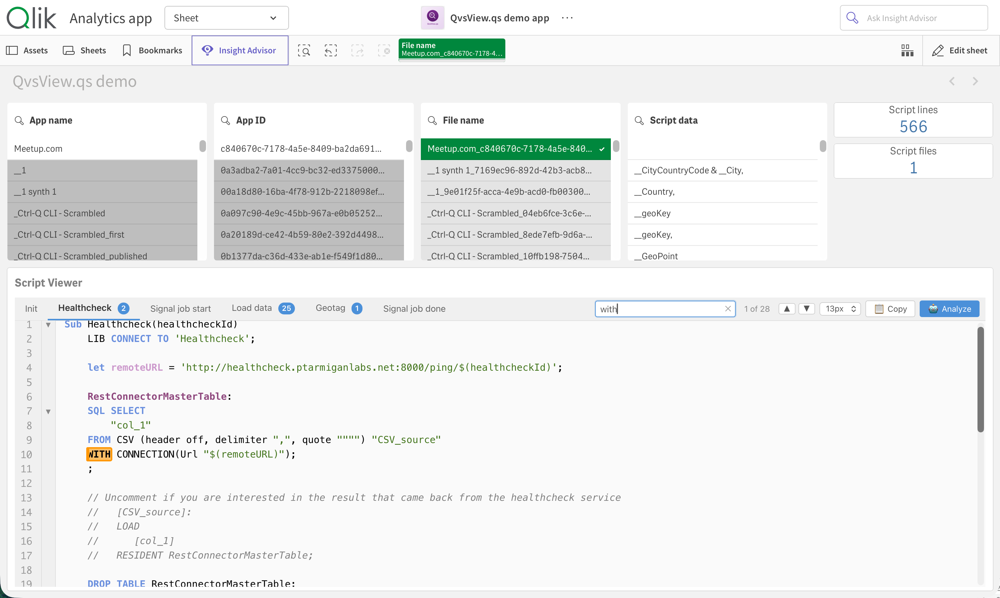

#### Step 4: Use AI Analysis

Click the **🤖 Analyze** button in the viewer toolbar to get an AI-powered review of the script (only works if you have first configured the AI provider in the extension properties).

The exact UX experience will differ depending on property panel settings, here is one example of how it can look:

First choose what to analyze:  
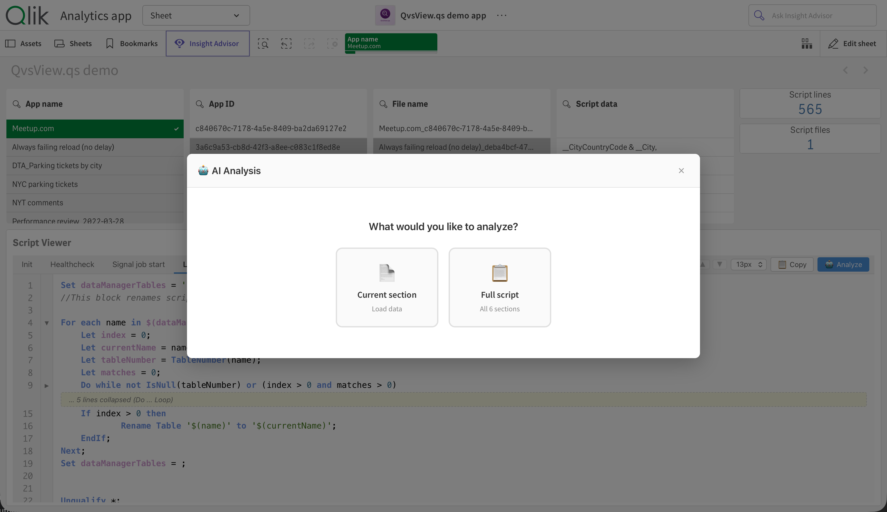

Then choose the type of analysis you want to run:  
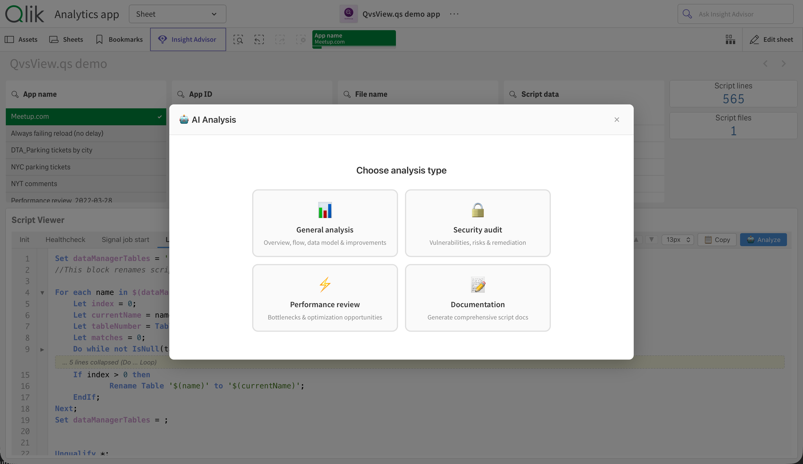

Some waiting time...  
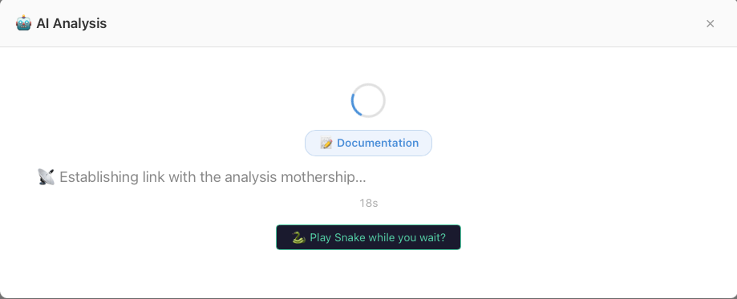

...takes some time...  
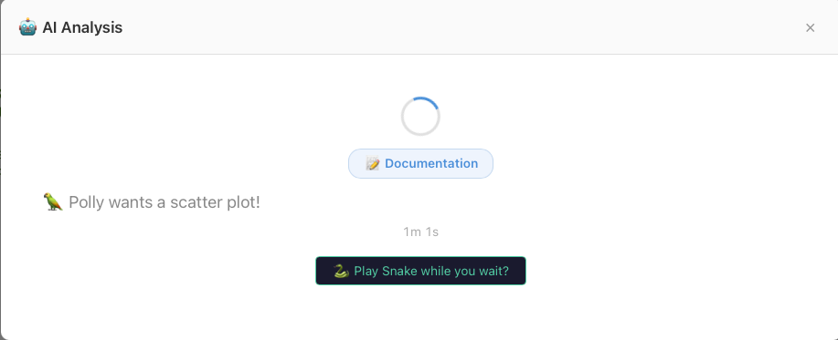

...play some Snake while waiting...  
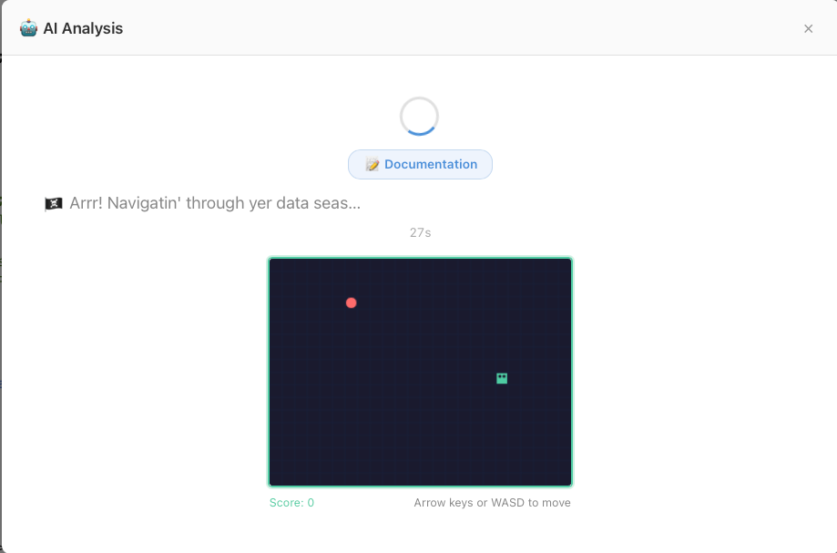

...and finally, here is the result:  
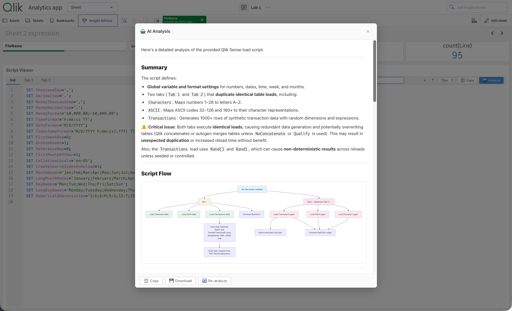

The AI can be surprisingly good (totally depending on the model used of course) at understanding the script and providing insights. In this example, it has identified a fairly complex script and created a data model diagram:  
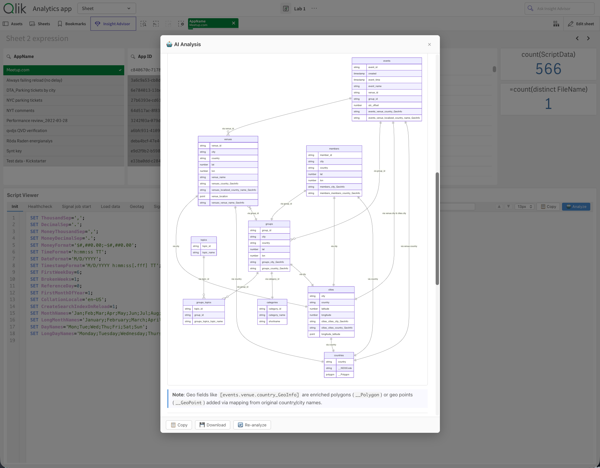

The AI returns Markdown-formatted results with Mermaid diagrams, cached for 30 minutes.

---

## 5. Local AI with Ollama

QvsView can send scripts to OpenAI, Anthropic or Ollama. For full data privacy, you can run a local AI using Ollama — no data leaves your network.

The same can be achieved by overriding the endpoint URL in the property panel and running a local AI using OpenAI or Anthropic models.

### Why a Reverse Proxy?

Ollama runs on HTTP, but Qlik Sense uses HTTPS by default. A reverse proxy (such as Caddy, nginx, or traefik) adds HTTPS to your local Ollama endpoint.

### Setup

1. **Install Ollama** — download from https://ollama.com/
2. **Start Ollama and a model**:
    ```bash
    ollama serve &
    ollama pull llama3.2
    ```
3. **Start a reverse proxy** to add HTTPS:

    ```bash
    # Using Caddy (macOS / Linux)
    caddy reverse-proxy --from https://localhost:11435 --to http://127.0.0.1:11434 --disable-redirects
    ```

4. **Configure the extension** in the property panel:
    - Go to **AI Analysis** → Enable AI Analysis
    - Set **Provider** to `Ollama`
    - Set **Endpoint** to `https://localhost:11435`
    - Set **Model** to your model (e.g., `llama3.2`)

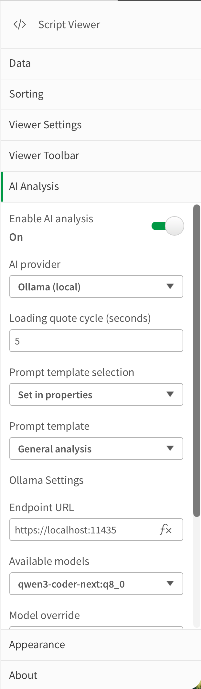

### Test the Connection

Click **Test Connection** to verify the endpoint and model are reachable.

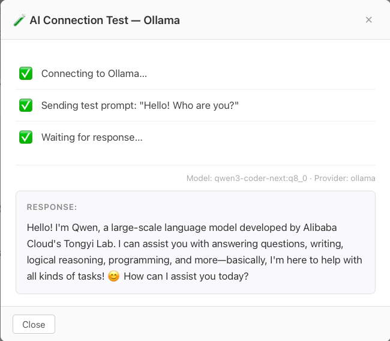

> **Note**: Setting up Ollama and downloading models is beyond the scope of this guide. See https://ollama.com/ for full documentation.

### Alternative Providers

If you have access to OpenAI or Anthropic through other means, you can override the endpoint URLs in the property panel:

| Provider  | Default endpoint               | Override supported |
| --------- | ------------------------------ | ------------------ |
| Ollama    | `http://127.0.0.1:11434`       | Yes                |
| OpenAI    | `https://api.openai.com/v1`    | Yes                |
| Anthropic | `https://api.anthropic.com/v1` | Yes                |

This allows use of third-party API-compatible services or self-hosted models.

---

## Next Steps

- Adjust viewer settings in the property panel: font size, line numbers, code folding
- Explore section tabs for quick navigation between script sections
- Use the copy button to export script sections or the full script

For full feature details, see [README.md](README.md).
