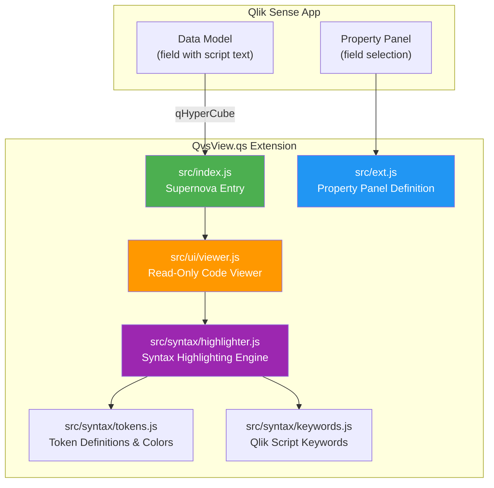
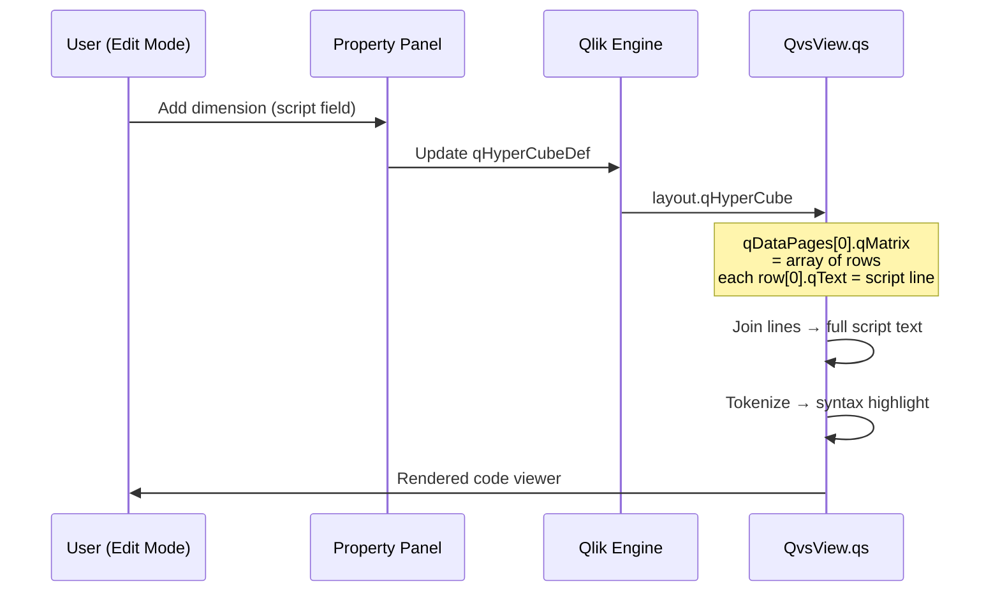
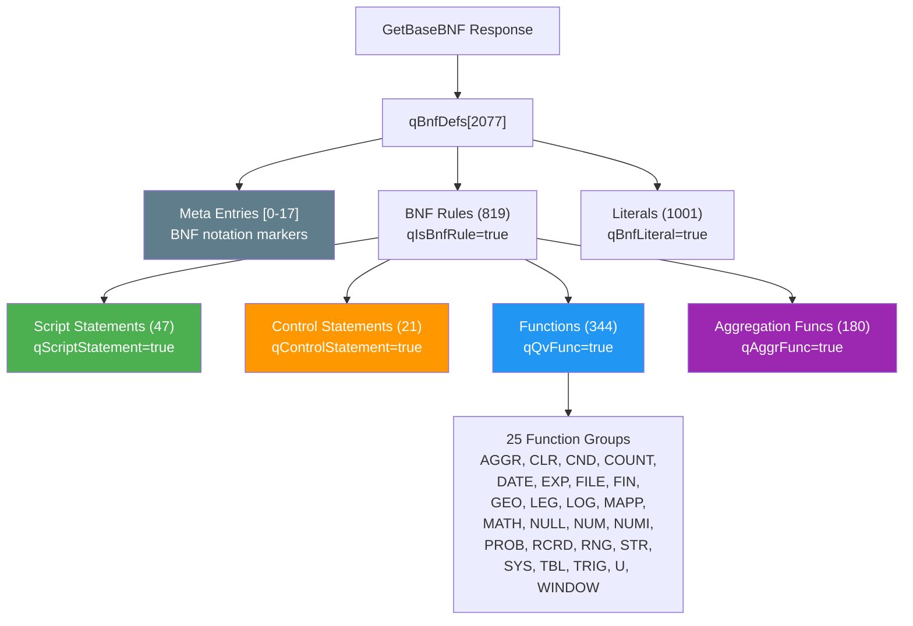
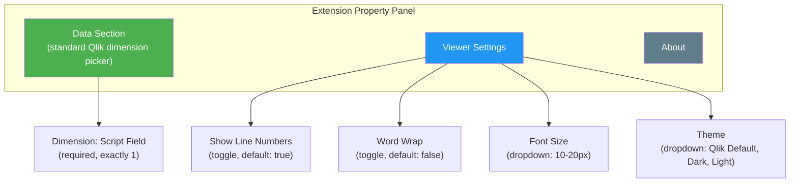

# QvsView.qs — Qlik Sense Script Viewer Extension Plan

## Goal

Build a Qlik Sense visualization extension that displays Qlik load scripts in a **read-only code viewer** with **syntax highlighting**, deployed as a standard Supernova extension via nebula.js.

The script text comes from the **app's data model** — the user selects a field (dimension) containing script lines, just like configuring a table or bar chart.

---

## Architecture Overview



---

## How the Data Flows



---

## Syntax Highlighting Strategy

### Token Types

Qlik Sense's native Data Load Editor uses 10 token types with these exact colors:

| Token          | Color                                                        | Hex       | Weight | Style  | Examples                               |
| -------------- | ------------------------------------------------------------ | --------- | ------ | ------ | -------------------------------------- |
| **keyword**    |  | `#6A8FDE` | bold   | normal | `LOAD`, `SELECT`, `SET`, `LET`, `DROP` |
| **function**   |  | `#6A8FDE` | bold   | normal | `Date()`, `Sum()`, `Left()`            |
| **variable**   |  | `#CC99CC` | bold   | normal | `$(vMyVar)`, `$(=expression)`          |
| **field**      |  | `#CC9966` | bold   | normal | Field references                       |
| **table**      |  | `#8E477D` | bold   | normal | Table names in `RESIDENT` etc.         |
| **string**     |  | `#44751D` | normal | normal | `'hello'`, `"world"`                   |
| **comment**    |  | `#808080` | normal | italic | `// line`, `/* block */`, `REM ;`      |
| **operator**   |  | `#000000` | normal | normal | `+`, `-`, `*`, `/`, `=`                |
| **normalText** |  | `#000000` | normal | normal | Identifiers, unresolved tokens         |

### Implementation Approach: Regex-Based Tokenizer

For a **read-only viewer** (no editing, no autocomplete), a regex-based tokenizer is the right trade-off:

```mermaid
flowchart LR
    A[Script Text] --> B[Line Splitter]
    B --> C[State Machine<br/>per line]
    C --> D{Token Type?}
    D -->|"// or /* */"| E[comment]
    D -->|"' or \""| F[string]
    D -->|"$(...)"|G[variable]
    D -->|"keyword match"| H[keyword]
    D -->|"function match"| I[function]
    D -->|"operator char"| J[operator]
    D -->|"other"| K[normalText]
    E & F & G & H & I & J & K --> L[HTML Spans<br/>with CSS classes]
```

The tokenizer is **stateful** across lines to handle:

- Multi-line `/* block comments */`
- Multi-line strings (rare but valid)
- `REM` comments (extend to `;`)

### Keyword Source: Official BNF Grammar

The complete, authoritative keyword list comes from **Qlik's Engine JSON API** via `GetBaseBNF(qBnfType="S")`. We have a downloaded copy at `bnf/getBaseBNF_result.json` (557 KB, 2,077 entries).

Extracted totals:

- **47 script statement keywords**: `LOAD`, `SELECT`, `SET`, `LET`, `STORE`, `DROP`, `CONNECT`, `RENAME`, `QUALIFY`, `UNQUALIFY`, etc.
- **21 control keywords**: `IF`, `THEN`, `ELSE`, `ELSEIF`, `ENDIF`, `FOR`, `NEXT`, `DO`, `LOOP`, `WHILE`, `UNTIL`, `SUB`, `ENDSUB`, `CALL`, `SWITCH`, `CASE`, `DEFAULT`, `ENDSWITCH`, `EXIT`, `SCRIPT`, `END`
- **344 unique functions** across 25 groups: aggregation, string, date/time, math, range, color, conditional, system, file, geo, etc.

---

## BNF Grammar Details

### Structure



### BNFDef Entry Schema

| Field               | Type   | Description                                 |
| ------------------- | ------ | ------------------------------------------- |
| `qNbr`              | int    | 0-based index into `qBnfDefs[]`             |
| `qBnf`              | int[]  | Child indices (tree structure)              |
| `qName`             | string | Rule/function name                          |
| `qStr`              | string | Literal text (for `qBnfLiteral=true`)       |
| `qPNbr`             | int    | Parent index                                |
| `qIsBnfRule`        | bool   | Is a grammar rule (non-terminal)            |
| `qBnfLiteral`       | bool   | Is a literal token (terminal)               |
| `qScriptStatement`  | bool   | Is a script statement                       |
| `qControlStatement` | bool   | Is a control statement                      |
| `qQvFunc`           | bool   | Is a QlikView/Qlik function                 |
| `qAggrFunc`         | bool   | Is an aggregation function                  |
| `qFG`               | string | Function group (e.g., "DATE", "STR")        |
| `qMT`               | string | Meta type: N=normal, D=deprecated, R=return |
| `qDepr`             | bool   | Is deprecated                               |

### Tree Navigation

The `qBnf` array uses special meta-entries as BNF notation:

- `[9]`/`[10]` → Optional start/end `[ ]`
- `[14]`/`[15]` → Repeat start/end `{ }`
- `[16]`/`[17]` → Group start/end
- `[0]` → Terminator

Example: `LOAD` statement rule's `qBnf` references child indices that describe its full syntax: `LOAD [DISTINCT] fieldlist FROM ...`

---

## Optional Route: Hooking Into Qlik Sense's Own BNF Parser

### The Opportunity

Qlik Sense's web client already contains a **fully functional BNF-based tokenizer** (`bnfLang`) that powers the Data Load Editor. Since QvsView.qs will be deployed **inside the same Qlik Sense client**, this parser is loaded in memory and potentially accessible.

### What We Know

From live investigation of the Qlik Sense client:

```
bnfLang = {
    getNextToken_Line()     // Core tokenizer — walks BNF grammar tree
    createStartToken()      // Initializes tokenizer state
    parseIntoTokens()       // Tokenizes a full script
    parseTextIntoColorStructure()  // Returns colored token spans
}
```

The parser is loaded as an AMD module (RequireJS) inside Qlik Sense. It is the engine behind CodeMirror 5's custom `sense-script` mode.

### How to Access It

```mermaid
flowchart TD
    A[QvsView.qs Extension<br/>runs inside Qlik Sense] --> B{Can we access<br/>bnfLang?}
    B -->|"require('general.utils/bnf-lang')"| C[AMD Module<br/>via RequireJS]
    B -->|"window.__qvScriptEditor"| D[Global Reference<br/>if exposed]
    B -->|"CodeMirror mode registry"| E[CM.getMode('sense-script')<br/>then extract tokenizer]

    C --> F{Available?}
    D --> F
    E --> F

    F -->|Yes| G["Use bnfLang.parseTextIntoColorStructure()<br/>for perfect syntax highlighting"]
    F -->|No| H["Fall back to<br/>regex-based tokenizer"]

    style G fill:#4CAF50,color:#fff
    style H fill:#FF9800,color:#fff
```

### Potential AMD Module Paths to Try

Qlik Sense loads scripts via RequireJS. The BNF parser may be accessible at one of these module IDs:

```javascript
// Attempt 1: Common utility namespace
require(['general.utils/bnf-lang'], function(bnfLang) { ... });

// Attempt 2: Script editor namespace
require(['client.services/scripting/bnf-lang'], function(bnfLang) { ... });

// Attempt 3: CodeMirror mode registration
const cm = CodeMirror(document.createElement('div'), { mode: 'sense-script' });
const tokenizer = cm.getMode({}, 'sense-script');

// Attempt 4: Iterate RequireJS registry
// RequireJS stores loaded modules in require.s.contexts._.defined
const defined = require.s?.contexts?._?.defined || {};
const bnfKey = Object.keys(defined).find(k => k.includes('bnf'));
```

### Pros and Cons

|                           | Regex Tokenizer (our own)                          | Qlik's BNF Parser (hook in)                             |
| ------------------------- | -------------------------------------------------- | ------------------------------------------------------- |
| **Accuracy**              | ~90% (keywords + strings + comments)               | 100% (exact match to Data Load Editor)                  |
| **Field/table detection** | Not possible without data model context            | Built-in — grammar tracks field/table state             |
| **Maintenance**           | Must update keywords per Qlik version              | Automatically matches the running Qlik version          |
| **Portability**           | Works anywhere (Cloud, client-managed, standalone) | Only works inside Qlik Sense client                     |
| **Risk**                  | None — fully self-contained                        | AMD paths may change between versions; undocumented API |
| **Complexity**            | Low                                                | Medium (AMD discovery + error handling + fallback)      |

### Recommendation

**Build the regex-based tokenizer first** (guaranteed to work), then add BNF parser detection as an optional enhancement:

```javascript
// Strategy: Try Qlik's native parser first, fall back to regex
async function getTokenizer() {
    try {
        const bnfLang = await discoverBnfLang();
        if (bnfLang?.parseTextIntoColorStructure) {
            return createBnfTokenizer(bnfLang);
        }
    } catch {
        // Native parser not available
    }
    return createRegexTokenizer();
}
```

This gives us the best of both worlds: portable correctness with an optional accuracy upgrade when running inside Qlik Sense.

---

## Extension Property Panel Design



The **dimension picker** is the standard Qlik Sense interface — users drag a field or master dimension onto it. When the user adds a dimension, the extension receives the field values via `layout.qHyperCube.qDataPages`.

---

## Technology Stack

| Component           | Choice                              | Rationale                                 |
| ------------------- | ----------------------------------- | ----------------------------------------- |
| Extension framework | nebula.js (Supernova)               | Standard for modern Qlik Sense extensions |
| Build tool          | Rollup (via `@nebula.js/cli-build`) | Same as onboard.qs, proven pipeline       |
| Module format       | UMD (single file)                   | Required by Qlik Sense extension loader   |
| Source format       | ESM (`"type": "module"`)            | Modern JS, transpiled to UMD by Rollup    |
| Syntax highlighting | Custom regex tokenizer              | Lightweight, no external dependencies     |
| Dependencies        | None (runtime)                      | Self-contained, no vendor bloat           |

---

## File Structure

```
QvsView.qs/
├── .github/
│   └── copilot-instructions.md
├── bnf/
│   └── getBaseBNF_result.json          # Reference BNF grammar
├── docs/
│   └── qlik-script-viewer-plan.md      # This file
├── scripts/
│   ├── build-date.cjs
│   ├── post-build.mjs
│   └── zip-extension.mjs
├── src/
│   ├── ext/
│   │   ├── index.js                    # Property panel entry
│   │   ├── viewer-section.js           # Viewer settings section
│   │   └── about-section.js            # About section
│   ├── syntax/
│   │   ├── highlighter.js              # Tokenizer → HTML renderer
│   │   ├── keywords.js                 # Statement + control keywords
│   │   └── tokens.js                   # Token type definitions + CSS
│   ├── ui/
│   │   └── viewer.js                   # Read-only code viewer renderer
│   ├── util/
│   │   └── logger.js                   # Logger with build-type awareness
│   ├── data.js                         # Hypercube target definition
│   ├── index.js                        # Supernova entry point
│   ├── meta.json                       # Extension metadata
│   ├── object-properties.js            # Default properties
│   └── style.css                       # Viewer styles
├── AGENTS.md
├── eslint.config.js
├── nebula.config.cjs
├── package.json
└── .prettierrc.yaml
```

---

## Phase Plan

### Phase 1: Scaffold & Data Binding (current)

- [x] Analyze Qlik Sense editor technology
- [x] Extract BNF grammar and keyword lists
- [ ] Scaffold nebula.js extension project
- [ ] Implement hypercube data target (1 dimension)
- [ ] Render raw script text in viewer
- [ ] Basic property panel (viewer settings)

### Phase 2: Syntax Highlighting

- [ ] Build regex tokenizer (comments, strings, keywords, functions)
- [ ] Apply token colors matching Qlik Sense editor
- [ ] Add variable detection (`$(...)`)
- [ ] Parse BNF for authoritative keyword list

### Phase 3: Viewer Features

- [ ] Line numbers
- [ ] Word wrap toggle
- [ ] Font size control
- [ ] Theme options (light/dark)
- [ ] Script section detection (tab headers)

### Phase 4: BNF Parser Integration (optional)

- [ ] AMD module discovery for `bnfLang`
- [ ] Adapter wrapping native tokenizer
- [ ] Fallback chain: native → regex
- [ ] Field/table name highlighting via native parser
