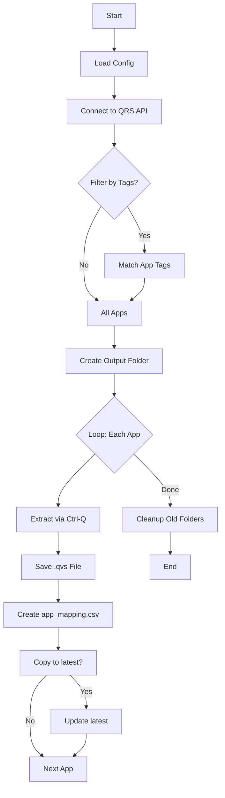
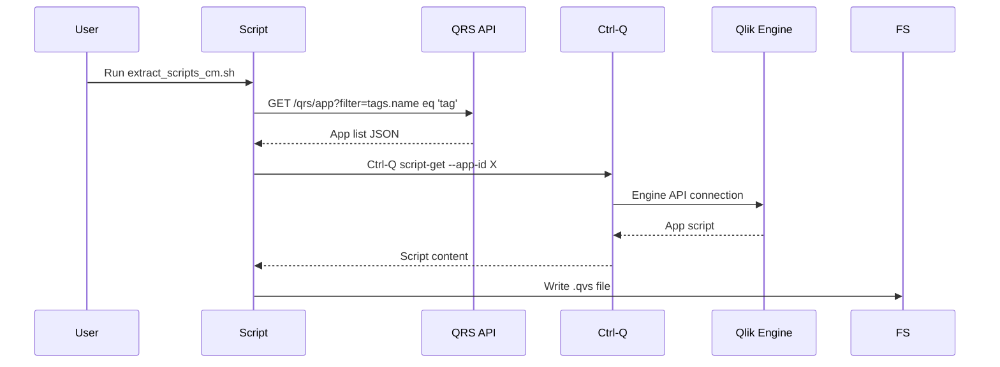

# Tool: Extract App Scripts

Extracts load scripts from Qlik Sense applications to `.qvs` files.

## Contents

| Script                              | Type    | Description               |
| ----------------------------------- | ------- | ------------------------- |
| `bash/extract_scripts_cm.sh`        | bash    | Template (generic config) |
| `powershell/extract_scripts_cm.ps1` | pwsh 7+ | Template (generic config) |

## Requirements

- **Ctrl-Q**: [Ptarmigan Labs Ctrl-Q](https://ctrl-q.ptarmiganlabs.com/)
    - Default path: `/Users/goran/tools/ctrl-q/ctrl-q`
    - Qlik Sense certificates for authentication

## Usage (Bash)

```bash
cd tool/extract-app-scripts/bash
./extract_scripts_cm.sh
```

## Usage (PowerShell 7+)

```bash
cd tool/extract-app-scripts/powershell
pwsh ./extract_scripts_cm.ps1
```

## Configuration (Bash)

Edit the configuration section at the top of `bash/extract_scripts_cm.sh`:

```bash
# === Qlik Sense Connection ===
QS_HOST="qlikserver.domain.com"
QS_PORT="4242"                   # QRS API port
QS_ENGINE_PORT="4747"           # Engine port
QS_VIRTUAL_PROXY=""             # Optional: "/qvd"
QS_AUTH_TYPE="cert"             # "cert" or "sense"
QS_CERT_FILE="./cert/client.pem"
QS_CERT_KEY_FILE="./cert/client_key.pem"
QS_ROOT_CERT_FILE="./cert/root.pem"
INSECURE_SSL=false              # Set true for self-signed certs

# === Ctrl-Q Tool ===
CTRLQ_BIN="/path/to/ctrl-q"

# === App Filter ===
# Multiple tags use OR logic. Example: APP_TAGS=("Production" "Finance")
APP_TAGS=()

# === Output ===
DEST_ROOT="./output"
ENABLE_TIMESTAMP_FOLDER=true
ENABLE_LATEST_FOLDER=true

# === Logging ===
DEBUG_MODE=false                # Set to true for verbose debug output

# === Retention ===
RETENTION_DAYS=30
RETENTION_ENABLED=true
```

## Configuration (PowerShell)

Edit the configuration section at the top of `powershell/extract_scripts_cm.ps1`:

```powershell
# === Qlik Sense Connection ===
$QS_HOST = "qlikserver.domain.com"
$QS_PORT = "4242"                  # QRS API port
$QS_ENGINE_PORT = "4747"            # Engine port
$QS_VIRTUAL_PROXY = ""             # Optional: "/qvd"
$QS_AUTH_TYPE = "cert"            # "cert" or "sense"
$QS_CERT_FILE = "./cert/client.pem"
$QS_CERT_KEY_FILE = "./cert/client_key.pem"
$QS_ROOT_CERT_FILE = "./cert/root.pem"
$INSECURE_SSL = $false           # Set $true for self-signed certs

# === Ctrl-Q Tool ===
$CTRLQ_BIN = "C:\path\to\ctrl-q.exe"

# === App Filter ===
# Multiple tags use OR logic. Example: $APP_TAGS = @("Production", "Finance")
$APP_TAGS = @()

# === Output ===
$DEST_ROOT = "./output"
$ENABLE_TIMESTAMP_FOLDER = $true
$ENABLE_LATEST_FOLDER = $true

# === Logging ===
$DEBUG_MODE = $false              # Set to $true for verbose debug output

# === Retention ===
$RETENTION_DAYS = 30
$RETENTION_ENABLED = $true
```

## Folder Structure

```
tool/extract-app-scripts/
├── README.md
├── bash/
│   └── extract_scripts_cm.sh           # Main extraction script (template)
└── powershell/
    └── extract_scripts_cm.ps1          # PowerShell 7+ template
```

## Output Structure

```
output/
├── 2026-04-18_143052/              # Timestamped folder
│   ├── app_mapping.csv             # appId, appName, file_name mapping
│   ├── App1_id.qvs
│   ├── App2_id.qvs
│   └── ...
├── latest/                         # Copy of latest run
│   ├── app_mapping.csv
│   ├── App1_id.qvs
│   └── App2_id.qvs
```

## Mapping File (app_mapping.csv)

The `app_mapping.csv` file provides a complete traceback between Qlik Sense applications and the extracted files:

| app_id        | app_name      | file_name                     |
| ------------- | ------------- | ----------------------------- |
| `79f610f2...` | `My App Name` | `My_App_Name_79f610f2....qvs` |

## Flow



## API Interactions



## Debug Mode

- Set `DEBUG_MODE` to `true` (Bash) or `$true` (PowerShell) for verbose logging of HTTP requests, responses, and `ctrl-q` commands.
- View real-time progress and connectivity details in the terminal console.
- Errors are always logged to `stderr`.

## Troubleshooting

| Issue                                    | Fix                                         |
| ---------------------------------------- | ------------------------------------------- |
| Script exits early with DEBUG_MODE=false | Update to latest version - bug fixed        |
| SSL certificate errors                   | Set `INSECURE_SSL=true`                     |
| No apps found                            | Check `APP_TAGS` filter or QRS connectivity |
| Ctrl-Q not found                         | Verify `CTRLQ_BIN` path in config           |
